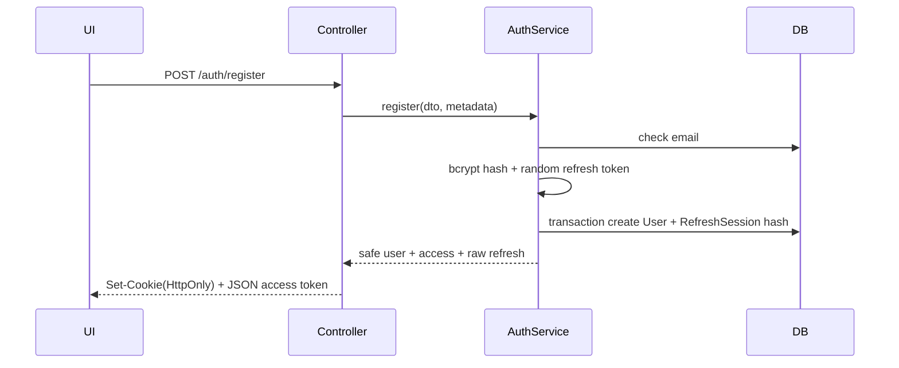
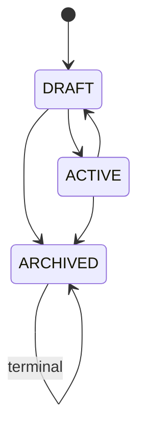
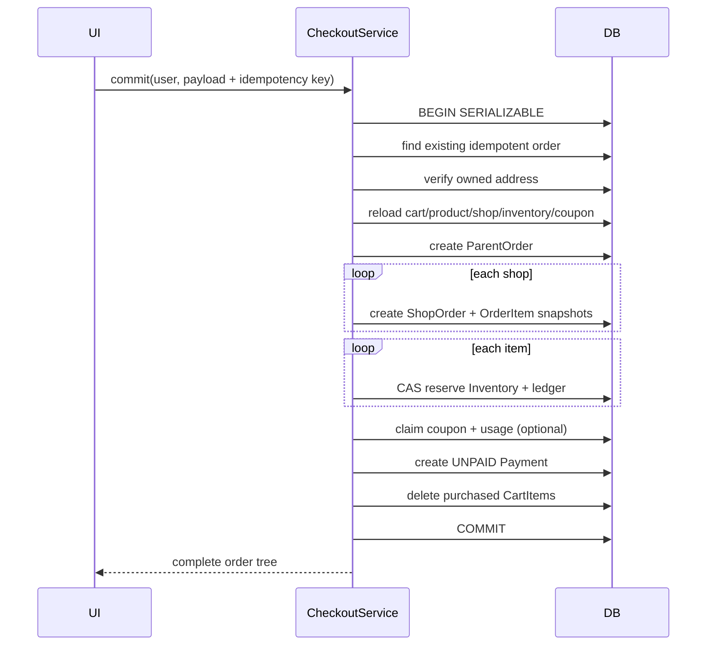
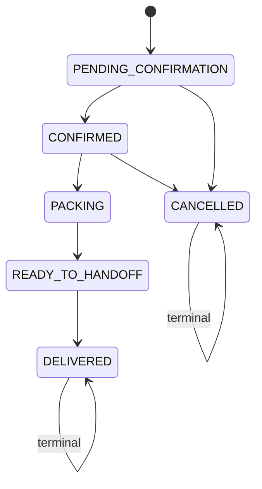

# Codebase Handbook - Multi-Vendor Commerce Platform

Last updated: 2026-08-04

Tài liệu này giải thích code và luồng chạy hiện tại của dự án cho developer mới, đặc biệt là fresher. Đây không phải tài liệu ý tưởng: nội dung được bám theo source code đang có đến hết Phase 3.

Khi code thay đổi, tài liệu này phải được cập nhật cùng task. Không để tài liệu mô tả endpoint, trạng thái hoặc invariant đã khác với code.

---

## 1. Cách sử dụng tài liệu

Nếu mới vào dự án, đọc theo thứ tự:

1. Kiến trúc và cấu trúc thư mục.
2. Request lifecycle của backend.
3. Data model và các invariant cốt lõi.
4. Authentication/RBAC.
5. Luồng chức năng đang cần sửa.
6. Testing, debug và checklist thêm chức năng.

Khi trace một API, luôn đi theo hướng:

```text
Browser/UI
  -> lib/api.ts
  -> HTTP route
  -> Guard
  -> DTO + ValidationPipe
  -> Controller
  -> Service
  -> Prisma query/transaction
  -> PostgreSQL
  -> JSON response
  -> React state/UI
```

Không bắt đầu sửa service trước khi hiểu:

- Ai được phép gọi chức năng?
- Input được DTO validate như thế nào?
- Bảng nào bị đọc/ghi?
- Có cần transaction không?
- Invariant nào phải giữ?
- Nếu hai request chạy đồng thời thì chuyện gì xảy ra?
- Test nào chứng minh hành vi đó?

---

## 2. Trạng thái hiện tại của hệ thống

Đã chạy thật:

- Authentication bằng access JWT và opaque refresh token.
- RBAC cho customer, vendor, admin.
- Profile và address.
- Shop onboarding và admin review.
- Category management.
- Public catalog và vendor product management.
- Inventory và inventory ledger.
- Cart.
- Checkout quote và checkout commit.
- Coupon evaluation trong checkout.
- Parent order, shop order và order item snapshot.
- Customer order history/cancel.
- Vendor fulfillment.
- Payment record, payment state transition và audit history.
- Customer/vendor/admin UI tương ứng.

Chưa hoàn thiện hoặc mới là placeholder:

- `ReviewsModule` đã có module shell và schema nhưng chưa có controller/service/UI.
- Bank transfer mới tạo payment record; chưa có provider adapter hoặc webhook có chữ ký.
- Refund status đã có trong enum nhưng code không cho chuyển sang refund cho tới khi có model refund transaction riêng.
- Chưa có API/UI quản trị coupon campaign.
- Redis và RabbitMQ đã có local infrastructure nhưng business flow hiện tại chưa publish/consume message.
- Chưa có notification, rate limiting, structured logging, request ID, CI/CD production hoàn chỉnh.

Không được mô tả các mục “chưa hoàn thiện” như tính năng production-ready.

---

## 3. Kiến trúc tổng thể

### 3.1 Monorepo

```text
intern_project/
├── apps/
│   ├── api/                 NestJS backend
│   │   ├── prisma/          Schema, migrations, seed
│   │   └── src/             Modules và bootstrap
│   └── web/                 Next.js App Router frontend
│       ├── app/             Route pages
│       ├── components/      UI dùng chung
│       └── lib/             API/session helpers
├── packages/
│   └── shared/              Nơi dành cho shared types/constants
├── docs/                    Tài liệu kỹ thuật và kế hoạch
└── .agents/                 Quy tắc làm việc của coding agent
```

Root `package.json` dùng npm workspaces. Vì vậy lệnh ở root có thể gọi từng workspace:

```bash
npm run lint
npm run build
npm test -w @intern-project/api
```

### 3.2 Backend: modular monolith

Backend là một process NestJS nhưng chia theo bounded context:

- `auth`: danh tính và session.
- `users`: profile/address.
- `shops`: onboarding và ownership.
- `catalog`: category/product.
- `inventory`: stock và ledger.
- `cart`: giỏ hàng.
- `checkout`: pricing và tạo đơn nguyên tử.
- `orders`: fulfillment.
- `payments`: payment state.
- `reviews`: placeholder cho Phase 4.

“Modular monolith” nghĩa là deploy chung nhưng boundary logic vẫn rõ. Không được query/chỉnh dữ liệu domain khác tùy tiện nếu có thể gọi service sở hữu domain đó. Ví dụ `CatalogService` dùng `ShopsService.assertOwner()` để kiểm tra shop ownership.

### 3.3 Frontend: workflow-first Next.js

Frontend dùng Next.js App Router. Các page hiện tại là client component vì cần local state, browser local storage và gọi API trực tiếp.

Không có state-management library toàn cục. Mỗi page quản lý:

- `loading`
- `error`
- dữ liệu trả về
- trạng thái form/submitting

`apps/web/lib/api.ts` là điểm chung cho URL API, Bearer token, refresh retry, error parsing và format tiền.

### 3.4 Infrastructure

Docker Compose cung cấp:

| Service | Host port | Vai trò hiện tại |
|---|---:|---|
| PostgreSQL 16 | 5433 | Database chính, đang dùng thật |
| Redis 7 | 6380 | Hạ tầng chuẩn bị, chưa nối business flow |
| RabbitMQ | 5673 | Hạ tầng async chuẩn bị, chưa nối business flow |
| RabbitMQ UI | 15673 | Trang quản trị RabbitMQ |

Không thêm Redis/RabbitMQ vào một flow chỉ vì chúng tồn tại. Chỉ dùng khi có yêu cầu rõ về cache/event, failure handling và test.

### 3.5 Environment variables

| Biến | App | Ý nghĩa | Default/fallback trong code |
|---|---|---|---|
| `DATABASE_URL` | API/Prisma | PostgreSQL connection string | Bắt buộc cho Prisma |
| `REDIS_URL` | API | Redis connection chuẩn bị | Chưa được business module dùng |
| `RABBITMQ_URL` | API | RabbitMQ connection chuẩn bị | Chưa được business module dùng |
| `JWT_ACCESS_SECRET` | API | Secret ký/verify access JWT | `change_me_access`, chỉ chấp nhận local |
| `JWT_ACCESS_TTL` | API | Thời gian sống access token | `15m` |
| `REFRESH_TOKEN_TTL_DAYS` | API | Cookie/session refresh TTL | `30` ngày |
| `FRONTEND_URL` | API | CORS allowed origin | `http://localhost:3000` |
| `PORT` | API | API listen port | `3005` |
| `SHIPPING_FEE_PER_SHOP` | API | Phí ship fixed cho mỗi shop khi quote | `30000` |
| `NEXT_PUBLIC_API_URL` | Web | Base URL browser gọi API | `http://localhost:3005/api` |

Không dùng fallback secret trong production. Secret và database URL thật không được commit.

### 3.6 Chạy local lần đầu

```bash
npm install
docker compose up -d
npm run prisma:generate -w @intern-project/api
npm run prisma:migrate -w @intern-project/api
npm run prisma:seed -w @intern-project/api
npm run dev
```

URL mặc định:

- Web: `http://localhost:3000`.
- API: `http://localhost:3005/api`.
- Health: `http://localhost:3005/api/health`.
- RabbitMQ management: `http://localhost:15673`.

Nếu sửa schema, generate lại Prisma Client trước khi build/test để TypeScript nhìn thấy model/field mới.

---

## 4. Backend request lifecycle

### 4.1 Bootstrap

Entry point: `apps/api/src/main.ts`.

Luồng khởi động:

1. `NestFactory.create(AppModule)` tạo dependency graph.
2. Lấy `ConfigService`.
3. Gọi `configureApp(app)`.
4. Listen tại `PORT`, mặc định `3005`.

`AppModule` import `ConfigModule`, `PrismaModule` và tất cả business modules.

### 4.2 Global configuration

`configure-app.ts` thiết lập:

- Prefix `/api` cho mọi route.
- `cookie-parser` để đọc refresh cookie.
- CORS chỉ cho `FRONTEND_URL`, mặc định `http://localhost:3000`.
- `credentials: true` để browser gửi HttpOnly cookie cross-origin giữa hai local port.
- Global `ValidationPipe`.

ValidationPipe có ba option quan trọng:

- `whitelist: true`: loại field không có decorator DTO.
- `forbidNonWhitelisted: true`: thực tế sẽ reject field lạ thay vì âm thầm bỏ qua.
- `transform: true`: cho phép class-transformer đổi query string thành number khi DTO dùng `@Type(() => Number)`.

Fresher thường mắc lỗi thêm field vào request nhưng quên thêm vào DTO; request sẽ bị `400` trước khi vào controller.

### 4.3 Module, controller, service, DTO

Vai trò từng lớp:

- Module: đăng ký controller/provider và dependency giữa bounded contexts.
- Controller: map HTTP, guard, param, body; không chứa business logic phức tạp.
- DTO: validate boundary input.
- Service: ownership, business rule, transaction, query.
- PrismaService: kết nối database và cung cấp Prisma Client.

Controller tốt trong dự án thường chỉ có dạng:

```ts
@Patch('resource/:id')
update(@CurrentUser() user, @Param('id') id, @Body() dto) {
  return this.service.update(user.sub, id, dto);
}
```

### 4.4 Prisma lifecycle

`PrismaService` extends `PrismaClient`:

- `onModuleInit()` gọi `$connect()`.
- `onModuleDestroy()` gọi `$disconnect()`.

Trong transaction callback, dùng `tx`, không dùng `this.prisma`, để tất cả write thuộc cùng transaction.

Sai:

```ts
await prisma.$transaction(async (tx) => {
  await tx.order.create(...);
  await prisma.inventory.update(...); // nằm ngoài transaction
});
```

Đúng:

```ts
await prisma.$transaction(async (tx) => {
  await tx.order.create(...);
  await tx.inventory.update(...);
});
```

---

## 5. Authentication, authorization và ownership

Ba khái niệm khác nhau:

- Authentication: request này là của user nào?
- Role authorization: role này có được gọi route không?
- Resource ownership: resource cụ thể có thuộc user này không?

JWT guard chỉ giải quyết authentication. RolesGuard chỉ giải quyết role. Service vẫn phải kiểm tra ownership.

Ví dụ vendor A và vendor B đều có role `VENDOR`; RolesGuard cho cả hai qua route sửa product. `CatalogService.assertProductOwner()` mới ngăn vendor B sửa product của vendor A.

### 5.1 Access token

Access token payload:

```json
{
  "sub": "user UUID",
  "email": "user@example.com",
  "role": "CUSTOMER | VENDOR | ADMIN"
}
```

`JwtStrategy` đọc `Authorization: Bearer <token>`, verify secret/expiry, rồi gán payload vào `request.user`.

`@CurrentUser()` lấy `request.user` để controller truyền `sub` xuống service.

### 5.2 RolesGuard

`@Roles(...)` ghi metadata. `RolesGuard` đọc metadata ở method/class:

1. Không có role requirement thì cho qua.
2. Có requirement thì kiểm tra `request.user.role` nằm trong danh sách.

Thứ tự guard thường là:

```ts
@UseGuards(JwtAuthGuard, RolesGuard)
```

JWT phải chạy trước để RolesGuard có `request.user`.

### 5.3 Ownership pattern

Các ownership check đang có:

- Shop: `ShopsService.assertOwner(shopId, ownerId)`.
- Product: `CatalogService.assertProductOwner(productId, ownerId)`.
- Inventory: đọc product -> shop -> owner.
- Address: query `where: { id: addressId, userId }`.
- Customer order: query `where: { id: orderId, userId }`.
- Vendor shop order: đọc shop order kèm shop và so `shop.ownerId`.

Ưu tiên filter ownership ngay trong query nếu có thể. Nó tránh trả về resource của người khác rồi mới xử lý.

---

## 6. Data model và quan hệ nghiệp vụ

### 6.1 Identity

```text
User 1 --- n UserAddress
User 1 --- n RefreshSession
User 1 --- n Shop
User 1 --- 1 Cart (unique userId)
User 1 --- n ParentOrder
```

- `User.passwordHash` không bao giờ được trả về API.
- `RefreshSession.tokenHash` lưu SHA-256, không lưu raw token.
- `UserAddress.isDefault` được service cố giữ đúng một địa chỉ mặc định nếu user có địa chỉ.

### 6.2 Catalog và inventory

```text
Shop 1 --- n Product
Category 1 --- n Product
Category 1 --- n Category (self hierarchy)
Product 1 --- 1 Inventory
Inventory 1 --- n InventoryLedger
```

Ba số stock:

- `onHand`: số vật lý hệ thống ghi nhận.
- `reserved`: số đã giữ cho order nhưng chưa hoàn tất.
- `sold`: số đã giao/bán hoàn tất.

Công thức duy nhất cho stock có thể bán:

```text
available = onHand - reserved
```

Không tạo cột `available`, vì nó là derived value và dễ lệch dữ liệu.

### 6.3 Cart

```text
User 1 --- 1 Cart
Cart 1 --- n CartItem
CartItem n --- 1 Product
```

Unique `(cartId, productId)` bảo đảm một product chỉ có một dòng trong cart. Add lại cùng product sẽ cộng quantity.

Cart không snapshot giá. Giá trong cart chỉ là preview; checkout luôn đọc lại Product hiện tại.

### 6.4 Order

```text
User
  └── ParentOrder (một lần checkout)
        ├── ShopOrder (phần của shop A)
        │     └── OrderItem snapshots
        ├── ShopOrder (phần của shop B)
        │     └── OrderItem snapshots
        ├── Payment
        │     └── PaymentStatusHistory
        └── CouponUsage
```

Lý do tách:

- Customer trả tiền/xem tổng theo ParentOrder.
- Mỗi vendor chỉ fulfill ShopOrder của mình.
- Shop A có thể cancel trong khi shop B vẫn delivered.
- Payment status không bị trộn với fulfillment status.

`OrderItem` lưu `productName`, `productImage`, `unitPrice`, `quantity`, `lineTotal`. Sau khi product đổi tên/giá/ảnh, order cũ vẫn giữ đúng lịch sử mua.

### 6.5 Money

Database dùng `Decimal(12,2)` và code dùng `Prisma.Decimal`.

Không dùng JavaScript floating point cho phép tính order. Ví dụ `0.1 + 0.2` không chính xác trong IEEE floating point. Convert sang number chỉ ở UI format/display khi phù hợp.

---

## 7. Luồng đăng ký tài khoản

Endpoint: `POST /api/auth/register`

Input chính:

- `email`: email hợp lệ.
- `password`: tối thiểu 8 ký tự.
- `fullName`.
- `phone`: optional.
- `role`: DTO nhận enum nhưng service chỉ chấp nhận `CUSTOMER`.

Luồng:

1. Global ValidationPipe validate `RegisterDto`.
2. `AuthController.register()` lấy body và metadata request.
3. `AuthService.register()` kiểm tra email trùng.
4. Nếu client cố đăng ký `VENDOR`/`ADMIN`, trả `400`.
5. Hash password bằng bcrypt cost 12.
6. Sinh refresh token random 48 bytes dạng base64url.
7. Mở transaction:
   - tạo User;
   - hash refresh token bằng SHA-256;
   - tạo RefreshSession.
8. Ký access JWT.
9. Controller set raw refresh token vào HttpOnly cookie.
10. Response chỉ trả safe user và access token.



Tại frontend, `/register` lưu `{accessToken, user}` vào local storage rồi chuyển tới `/vendor/shop`, nơi customer có thể gửi shop request. User không tự nâng role.

---

## 8. Luồng login, refresh và logout

### 8.1 Login

Endpoint: `POST /api/auth/login`.

1. Tìm user theo email.
2. Dùng bcrypt compare password.
3. Reject nếu account không `ACTIVE`.
4. Sinh refresh token mới và tạo RefreshSession.
5. Trả access token; refresh token nằm trong HttpOnly cookie.

Thông báo “Invalid credentials” cố tình giống nhau cho email không tồn tại và password sai, tránh user enumeration.

### 8.2 Frontend authenticated request

`apiRequest(path, init, true)`:

1. Đọc session từ local storage.
2. Nếu không có session, throw “Please sign in to continue”.
3. Gắn `Authorization: Bearer ...`.
4. Gọi fetch với `credentials: include`.
5. Nếu response `401`, gọi refresh đúng một lần.
6. Lưu access token mới.
7. Retry request gốc một lần.

Biến module-level `refreshRequest` chống nhiều request cùng lúc tạo nhiều refresh call. Các request cùng chờ một Promise.

### 8.3 Refresh token rotation

Endpoint: `POST /api/auth/refresh`.

1. Browser tự gửi cookie vì `credentials: include`.
2. Service hash raw token.
3. Tìm RefreshSession theo hash.
4. Reject nếu không có, revoked, expired hoặc user inactive.
5. Sinh token kế tiếp.
6. Trong transaction, `updateMany` session cũ với điều kiện `revokedAt: null`.
7. Nếu count khác 1, token đã được dùng/race -> reject.
8. Tạo session mới và set cookie mới.

Đây là rotation: mỗi refresh token chỉ dùng một lần.

### 8.4 Logout

- `POST /auth/logout`: revoke session tương ứng cookie hiện tại, clear cookie.
- `POST /auth/logout-all`: cần JWT, revoke mọi active session của user, clear cookie hiện tại.

Frontend còn gọi `clearSession()` để xóa access token/user khỏi local storage.

Security note hiện tại: refresh token an toàn hơn nhờ HttpOnly cookie; access token vẫn ở local storage và cần CSP/in-memory hardening ở Phase 4.

---

## 9. Luồng profile và address

Tất cả route nằm dưới `/api/users/me` và cần JWT.

### 9.1 Profile

- `GET /users/me`: select safe fields.
- `PATCH /users/me`: update `fullName`, `phone`.

Service dùng `SAFE_USER_SELECT`, vì trả thẳng model User sẽ lộ `passwordHash`.

### 9.2 Tạo address

Endpoint: `POST /users/me/addresses`.

Transaction:

1. Đếm address hiện tại.
2. Address đầu tiên luôn default.
3. Nếu request chọn default, unset default cũ.
4. Tạo address mới.

### 9.3 Đổi default

Endpoint: `PATCH /users/me/addresses/:addressId`.

- Query theo cả `id` và `userId` để enforce ownership.
- Không cho unset trực tiếp default hiện tại, vì có thể tạo trạng thái không default.
- Khi set một address thành default, unset các address default khác trong cùng transaction.

### 9.4 Xóa address

Endpoint: `DELETE /users/me/addresses/:addressId`.

Nếu xóa default:

1. Xóa address.
2. Tìm address còn lại mới nhất.
3. Set nó thành default.

Checkout chỉ nhận address thuộc đúng customer và snapshot nội dung address vào ParentOrder. Sửa address profile sau đó không sửa địa chỉ của order cũ.

---

## 10. Luồng shop onboarding

### 10.1 Customer gửi shop request

Endpoint: `POST /api/shops`.

Allowed roles: `CUSTOMER`, `VENDOR`.

1. Validate name/slug.
2. Kiểm tra slug unique.
3. Tạo Shop với default status `PENDING_REVIEW`.

Tạo shop không tự biến user thành vendor.

### 10.2 Admin review

- `GET /shops/admin/review-queue`: chỉ ADMIN, lấy shop pending theo thứ tự cũ trước.
- `PATCH /shops/:shopId/review`: chỉ ADMIN.

Allowed review target: `APPROVED`, `REJECTED`, `SUSPENDED`.

Khi approve, transaction:

1. Update Shop status.
2. Nếu owner đang là CUSTOMER, update role thành VENDOR.

Nếu user đã VENDOR thì `updateMany` không làm gì, vẫn an toàn.

Lưu ý access JWT cũ chứa role cũ. Sau approve, user có thể cần login/refresh để token mới phản ánh role VENDOR.

### 10.3 Public shop

`GET /shops` chỉ trả shop `APPROVED` và select field public. Không trả owner internals.

---

## 11. Luồng category

### 11.1 Public tree

`GET /categories`:

1. Lấy toàn bộ category active.
2. Tạo Map `id -> node + children`.
3. Duyệt category:
   - có parent active trong map -> push vào parent.children;
   - không có parent -> trở thành root.
4. Trả tree arbitrary depth.

### 11.2 Admin create/update

- `POST /categories`
- `GET /admin/categories`
- `PATCH /categories/:categoryId`
- `PATCH /categories/:categoryId/status`

Parent validation:

- Parent phải tồn tại và active.
- Khi update parent, service đi ngược chuỗi ancestor.
- Nếu gặp chính category đang sửa, quan hệ mới sẽ tạo cycle -> reject.

Ví dụ không hợp lệ:

```text
A -> B -> C
update A.parentId = C
```

### 11.3 Deactivate category

Trước khi deactivate, service đếm song song:

- active child categories;
- product DRAFT/ACTIVE trực tiếp trong category.

Nếu còn dependency, reject. Admin phải deactivate child và archive/move product trước. Quy tắc này tránh catalog bị orphan/ngầm biến mất.

---

## 12. Luồng product/catalog

### 12.1 Public listing

Endpoint: `GET /api/products`.

Một product chỉ public khi đồng thời:

```text
Product.status == ACTIVE
Shop.status == APPROVED
Inventory.onHand > Inventory.reserved
```

Query hỗ trợ:

- `search`: contains name/description, case insensitive.
- `categoryId`.
- `page`, mặc định 1.
- `limit`, mặc định 20 và service cap tối đa 50.

Service chạy song song query items và count, trả `{items, total, page, limit}`.

`GET /products/:slug` dùng cùng visibility rule. Nếu product tồn tại nhưng draft/out-of-stock/shop suspended thì public API trả `null`, không làm lộ item private.

### 12.2 Vendor tạo product

Endpoint: `POST /shops/:shopId/products`, role VENDOR.

1. `assertOwner()` bảo đảm shop thuộc vendor.
2. Reject shop suspended.
3. Category phải tồn tại và active.
4. Transaction:
   - tạo Product;
   - tạo Inventory;
   - tạo ledger `INITIAL_STOCK`.

Ngay cả initial stock bằng 0 vẫn tạo ledger để có dấu vết khởi tạo.

### 12.3 Vendor update/status/archive

- `GET /shops/:shopId/products`: list sản phẩm shop của owner.
- `PATCH /products/:productId`: sửa field cho phép.
- `PATCH /products/:productId/status`: DRAFT/ACTIVE.
- `PATCH /products/:productId/archive`: archive terminal.

Invariant:

- Vendor không sửa product shop khác.
- Archived product không sửa hoặc reactivate.
- Không dùng status endpoint để archive; phải dùng archive endpoint để terminal action rõ ràng.
- Activate chỉ khi shop approved và category active.

Product status flow:



---

## 13. Luồng inventory và chống race condition

### 13.1 Đọc inventory

Endpoint: `GET /inventory/products/:productId`.

- VENDOR chỉ xem product của mình.
- ADMIN xem được mọi inventory.
- Response lấy tối đa 50 ledger mới nhất và thêm derived `available`.

### 13.2 Manual adjustment

Endpoint: `PATCH /inventory/products/:productId/adjust`, role VENDOR.

Input:

- `quantity`: delta, có thể dương hoặc âm.
- `reason`: InventoryReason.
- `note`: optional.

Không overwrite stock bằng một số tuyệt đối. Service tính:

```text
nextOnHand = currentOnHand + quantity
```

Nếu `nextOnHand < reserved`, reject. Hệ thống không được có nhiều hàng reserved hơn hàng on hand.

### 13.3 Compare-and-swap

Hai request có thể cùng đọc một version inventory. Service dùng conditional update:

```ts
updateMany({
  where: {
    id,
    onHand: valueJustRead,
    reserved: valueJustRead,
  },
  data: ...,
})
```

Nếu row đã bị request khác đổi, `count === 0`. Service rollback callback result và retry tối đa 3 lần. Hết retry trả `409 Conflict`.

Đây là optimistic concurrency control, không phải mutex trong memory. Nó vẫn đúng khi chạy nhiều API instance vì cạnh tranh được giải quyết ở database.

### 13.4 Ledger

Mọi stock change phải ghi ledger trong cùng transaction với inventory update.

Ý nghĩa delta:

| Event | deltaOnHand | deltaReserve | deltaSold |
|---|---:|---:|---:|
| Initial +10 | +10 | 0 | 0 |
| Manual add +5 | +5 | 0 | 0 |
| Reserve 2 | 0 | +2 | 0 |
| Cancel 2 | 0 | -2 | 0 |
| Deliver 2 | -2 | -2 | +2 |

Nếu inventory thay đổi mà ledger không có record tương ứng, đó là bug audit nghiêm trọng.

---

## 14. Luồng cart

Tất cả cart routes cần JWT và role CUSTOMER hoặc VENDOR.

### 14.1 Get cart

`GET /cart` dùng `upsert` theo unique `userId`. User chưa có cart sẽ được tạo empty cart.

Response mỗi item có:

- product/shop/category/inventory hiện tại;
- `available`;
- `lineTotal`;
- `isValid`;
- danh sách `errors`.

Cart tổng có `itemCount`, `subtotal`, `isValid`.

`isValid` chỉ true khi cart không rỗng và mọi item hợp lệ.

### 14.2 Add item

`POST /cart/items` input `{productId, quantity}`.

Transaction:

1. Upsert Cart.
2. Tìm CartItem cùng product.
3. `nextQuantity = existing + requested`.
4. Reject trên 99.
5. `assertPurchasable()`:
   - product tồn tại;
   - product ACTIVE;
   - shop APPROVED;
   - available đủ quantity mới.
6. Upsert CartItem.
7. Sau transaction, query lại và trả cart view mới.

### 14.3 Update/remove/clear

- `PATCH /cart/items/:itemId`: item phải thuộc cart user; validate stock với quantity mới.
- `DELETE /cart/items/:itemId`: deleteMany kèm `cart.userId`; count 0 -> not found.
- `DELETE /cart`: xóa tất cả item của cart user, không xóa Cart container.

Cart validation không reserve stock. Giữa lúc add cart và checkout, stock/price/shop status có thể đổi. Vì vậy checkout bắt buộc validate lại.

---

## 15. Checkout quote và pricing pipeline

Endpoint: `POST /checkout/quote`.

Input optional: `couponCode`.

Quote không ghi database. Nó trả preview dựa trên dữ liệu hiện tại.

### 15.1 Load và revalidate cart

`loadCartItems()` lấy cart item kèm product, shop, inventory. Mỗi item tính `lineTotal = price * quantity`.

Mỗi item được kiểm tra:

- Product ACTIVE.
- Shop APPROVED.
- `onHand - reserved >= quantity`.

Nếu có item lỗi, service trả `BadRequestException` với message và danh sách item lỗi. Không tự bỏ item lỗi khỏi checkout, vì customer phải biết order đang khác mong đợi.

### 15.2 Group theo shop

`groupItems()` dùng Map theo `shop.id`:

```text
Cart items
  -> Shop A: item 1, item 2, subtotal A
  -> Shop B: item 3, subtotal B
```

Mỗi group sau này trở thành một ShopOrder.

### 15.3 Shipping

Phí ship hiện tại là fixed per shop:

```text
shippingPerShop = SHIPPING_FEE_PER_SHOP || 30000
totalShipping = shippingPerShop * numberOfShops
```

Đây là policy đơn giản Phase 3, chưa phải shipping provider calculation.

### 15.4 Coupon validation

Code được trim và uppercase trước khi lookup.

Check:

1. Coupon tồn tại và active.
2. Đã tới `startsAt`.
3. Chưa qua `expiresAt`.
4. `usedCount < usageLimit` nếu có limit.
5. SHOP coupon phải có shop tương ứng trong cart.
6. Eligible subtotal đạt `minOrderAmount`.

Eligible subtotal:

- GLOBAL: toàn cart subtotal.
- SHOP: subtotal của đúng shop.

### 15.5 Tính discount

Percentage:

```text
eligibleSubtotal * value / 100
```

Fixed amount:

```text
min(eligibleSubtotal, coupon.value)
```

Sau đó áp `maxDiscount` nếu có và cap không vượt eligible subtotal. Kết quả làm tròn 2 decimal places.

GLOBAL discount được phân bổ tỷ lệ theo shop subtotal. Phần sai số rounding cuối cùng được đưa vào shop cuối để tổng allocation đúng bằng parent discount.

SHOP discount chỉ phân bổ cho shop áp dụng.

### 15.6 Công thức tổng

```text
parent subtotal = sum(shop subtotal)
parent discount = calculated coupon discount
parent shipping = shippingPerShop * shops
parent total    = subtotal - discount + shipping

shop total = shop subtotal - shop discount + shop shipping
```

Invariant phải đúng:

```text
sum(shop subtotal) = parent subtotal
sum(shop discount) = parent discount
sum(shop shipping) = parent shipping
sum(shop total)    = parent total
payment amount     = parent total
```

---

## 16. Checkout commit - luồng quan trọng nhất

Endpoint: `POST /checkout/commit`.

Input:

- `idempotencyKey`: 16-100 ký tự.
- `addressId`: UUID.
- `paymentMethod`: COD hoặc BANK_TRANSFER.
- `couponCode`: optional.

Toàn bộ commit chạy trong PostgreSQL `Serializable` transaction và retry tối đa 3 lần cho Prisma `P2002` hoặc `P2034`.

### 16.1 Fingerprint và idempotency

Fingerprint là SHA-256 của normalized:

```json
{
  "addressId": "...",
  "paymentMethod": "COD",
  "couponCode": "NORMALIZED-OR-NULL"
}
```

Database unique `(userId, idempotencyKey)`.

Khi request tới:

- Chưa có order cùng key: tạo order.
- Có order cùng key và fingerprint giống: trả order cũ.
- Có order cùng key nhưng fingerprint khác: `409 Conflict`.

Điều này bảo vệ double-click, browser retry và network timeout mà không cho một key đại diện hai ý định mua khác nhau.

Frontend giữ cùng key trong `useRef` khi retry đúng cùng address/payment/coupon. Khi payload thay đổi, tạo key mới.

### 16.2 Các bước trong transaction

Thứ tự hiện tại:

1. Tìm existing order bằng composite idempotency key.
2. Verify address thuộc user.
3. Chạy lại toàn bộ pricing pipeline trong transaction.
4. Tạo ParentOrder:
   - order number;
   - totals;
   - idempotency/fingerprint;
   - snapshot shipping address.
5. Với mỗi shop group, tạo ShopOrder.
6. Tạo OrderItem snapshot cho từng cart item.
7. Với từng product, conditional update Inventory để increment reserved.
8. Ghi ledger `ORDER_RESERVED` tham chiếu ParentOrder ID.
9. Nếu có coupon, conditional increment `usedCount`.
10. Tạo CouponUsage.
11. Tạo Payment `UNPAID`, amount bằng parent total.
12. Xóa đúng các CartItem đã checkout theo danh sách item ID.
13. Query lại ParentOrder với shop orders, items, payments, coupon usage.
14. Commit transaction.

Nếu bất kỳ bước nào fail, tất cả write rollback: không có order dở, không reserve mồ côi, không tăng coupon count, không clear cart.



### 16.3 Vì sao concurrent checkout không oversell

Giả sử stock `onHand=5`, `reserved=0`. Hai customer cùng mua 4.

1. Cả hai có thể cùng đọc available 5.
2. Request A conditional update với expected `(onHand=5,reserved=0)` thành reserved 4.
3. Request B không thể commit cùng expected state; update count 0 hoặc serializable conflict.
4. Request B retry transaction.
5. Lần retry đọc available `5-4=1`, không đủ 4 -> reject.

Kết quả chỉ một order thành công, reserved không vượt onHand.

Không thay conditional update bằng `inventory.update({ reserved: increment })` sau một check riêng; check-then-write như vậy có race condition.

### 16.4 Order item snapshot

Checkout copy từ Product vào OrderItem:

- `productId` để tham chiếu.
- `productName`.
- ảnh đầu tiên hoặc null.
- `unitPrice`.
- `quantity`.
- `lineTotal`.

Order UI và lịch sử phải ưu tiên snapshot fields, không query Product hiện tại để hiển thị lịch sử.

---

## 17. Customer order flow

### 17.1 List/detail

- `GET /orders`: chỉ order có `userId` hiện tại.
- `GET /orders/:orderId`: query theo cả order ID và user ID.

Include:

- shop orders và shop public identity;
- order item snapshots;
- payments và status history;
- coupon usages.

### 17.2 Customer cancel parent order

`PATCH /orders/:orderId/cancel` chạy Serializable transaction.

Điều kiện:

- Parent status phải `PLACED`.
- Payment chỉ được `UNPAID` hoặc `FAILED`.
- Mọi ShopOrder phải còn `PENDING_CONFIRMATION` hoặc `CONFIRMED`.

Với từng shop order chưa cancel:

1. Release inventory reserved.
2. Ghi ledger `ORDER_RELEASED` với deltaReserve âm.
3. Set ShopOrder `CANCELLED`.

Cuối cùng set ParentOrder `CANCELLED`.

Authorized/paid order không được cancel thẳng vì cần payment reversal/refund flow rõ ràng.

---

## 18. Vendor fulfillment flow

### 18.1 Vendor list shop orders

`GET /shops/:shopId/orders`:

1. `ShopsService.assertOwner()`.
2. Query ShopOrder theo shop.
3. Include items và một phần ParentOrder như shipping address/payment status.

Vendor không nhận toàn bộ internal data của shop order khác.

### 18.2 Explicit transitions

Allowed transitions:



`PATCH /shop-orders/:shopOrderId/status`:

1. Load ShopOrder + shop + items.
2. Verify owner.
3. Kiểm tra transition map.
4. Conditional update theo current status; count khác 1 -> concurrent conflict.
5. Nếu CANCELLED: release reserved + ledger.
6. Nếu DELIVERED: chuyển reserved thành sold.
7. Recalculate ParentOrder terminal status.

### 18.3 Deliver inventory conversion

Khi delivered quantity `q`:

```text
onHand   -= q
reserved -= q
sold     += q
```

Ledger:

```text
deltaOnHand  = -q
deltaReserve = -q
deltaSold    = +q
reason       = ORDER_SOLD
```

Conditional update yêu cầu `reserved >= q` và `onHand >= q`. Nếu không, dữ liệu inventory/order đã inconsistency và transaction phải fail.

### 18.4 Parent status aggregation

Sau mỗi terminal transition:

- Nếu chưa phải mọi ShopOrder terminal: ParentOrder giữ `PLACED`.
- Nếu mọi ShopOrder `CANCELLED`: ParentOrder `CANCELLED`.
- Nếu mọi ShopOrder terminal và có ít nhất một `DELIVERED`: ParentOrder `COMPLETED`.

Một checkout có shop A cancel và shop B delivered sẽ `COMPLETED`, không phải `CANCELLED`.

---

## 19. Payment flow

### 19.1 Payment creation

Checkout tạo một Payment:

- `parentOrderId`.
- `method`: COD hoặc BANK_TRANSFER.
- `status`: UNPAID.
- `amount`: ParentOrder total.

Fulfillment và payment là hai state machine độc lập. Vendor có thể chuẩn bị COD order khi payment còn UNPAID.

### 19.2 Admin state transition

Endpoint: `PATCH /payments/:paymentId/status`, chỉ ADMIN.

Allowed hiện tại:

```text
UNPAID -> AUTHORIZED
UNPAID -> FAILED
AUTHORIZED -> PAID
AUTHORIZED -> FAILED
```

Mọi transition khác bị reject, kể cả nhảy `UNPAID -> PAID`.

Transaction:

1. Load payment.
2. Validate transition map.
3. Conditional update theo status cũ.
4. Nếu PAID, set `paidAt`.
5. Tạo PaymentStatusHistory gồm from/to, actorId, note.
6. Update ParentOrder.paymentStatus summary.
7. Trả payment với history.

### 19.3 Refund limitation

Enum có `REFUND_PENDING`, `REFUNDED`, nhưng transition hiện bị khóa. Business rule yêu cầu refund là transaction/record riêng, không sửa ngược lịch sử payment gốc.

Khi triển khai refund phải bổ sung:

- Refund model/amount/provider reference/status.
- Rule không refund vượt paid amount.
- Idempotency cho provider webhook/refund request.
- Payment/Refund audit.
- Test partial/full refund và concurrent retry.

Không đơn giản mở `PAID -> REFUNDED` trong transition map.

---

## 20. Frontend API/session flow

### 20.1 `apiRequest`

Mọi page nên gọi `apiRequest<T>()` thay vì fetch trực tiếp, trừ refresh implementation bên trong helper.

Helper làm:

- prepend `NEXT_PUBLIC_API_URL`;
- set JSON content type nếu có body;
- gắn Bearer token khi `requireAuth=true`;
- gửi cookie;
- refresh/retry một lần khi 401;
- parse NestJS `message` string hoặc array;
- throw Error để page hiển thị.

Nếu endpoint protected nhưng quên truyền argument thứ ba `true`, request sẽ thiếu Bearer token.

### 20.2 Session storage

Local storage key: `intern-commerce-session`.

Lưu:

- accessToken.
- safe user.

Không lưu refresh token; nó thuộc HttpOnly cookie và JavaScript không đọc được.

### 20.3 Page pattern

Các page data-driven thường dùng:

1. `useState` cho data/loading/error.
2. `useCallback(load)`.
3. `useEffect` schedule `load()`.
4. Action gọi API.
5. Sau mutation, gọi lại `load()` để đồng bộ server state.

Mọi page phải có loading, error và empty state phù hợp.

---

## 21. Luồng từng màn hình frontend

### 21.1 `/login`

- Gọi `/auth/login`.
- Lưu session.
- Redirect theo role:
  - ADMIN -> `/admin/shops`.
  - VENDOR -> `/vendor/products`.
  - CUSTOMER -> `/`.

### 21.2 `/register`

- Gọi `/auth/register` không gửi role.
- Lưu customer session.
- Redirect `/vendor/shop` để user có thể request shop.

### 21.3 `/profile`

- Load song song profile và addresses.
- Update profile.
- Add address.
- Set default address.
- Logout: gọi backend revoke cookie session, sau đó luôn clear local session.

### 21.4 `/`

- Public load `/products`.
- Tính available để display.
- Add to cart gọi protected `/cart/items`.
- Nếu chưa login, helper trả lỗi yêu cầu sign in.

### 21.5 `/cart`

Load song song:

- Cart.
- User addresses.

Nếu cart có item, gọi checkout quote.

Quantity +/- gọi PATCH cart item. Remove gọi DELETE. Sau mutation, cart và quote được refresh.

Coupon chỉ được dùng cho commit sau khi quote apply thành công; state `appliedCoupon` tách khỏi text đang gõ để tổng hiển thị không lệch payload checkout.

Checkout:

1. Require address.
2. Build signature address/payment/applied coupon.
3. Reuse hoặc tạo `crypto.randomUUID()` idempotency key.
4. POST `/checkout/commit`.
5. Success -> `/orders?created=<id>`.
6. Failure -> giữ key để retry cùng payload không duplicate.

### 21.6 `/orders`

- Load customer ParentOrders.
- Render từng ShopOrder và OrderItem snapshot.
- Hiển thị parent fulfillment + payment status.
- Cho cancel khi parent còn PLACED; backend vẫn là nguồn quyết định cuối cùng.

### 21.7 `/vendor/shop`

- Load shop của current user.
- Nếu chưa có, hiện form onboarding.
- Nếu approved, có thể đi quản lý product.

### 21.8 `/vendor/products`

- Load `/shops/me` và categories.
- Chọn shop đầu tiên hiện tại.
- Load vendor products của shop.
- Create draft product với initial stock.
- Edit name/price.
- Toggle DRAFT/ACTIVE.
- Archive terminal.

Backend ownership/status rules vẫn bắt buộc; disabled button trên UI không phải security control.

### 21.9 `/vendor/orders`

- Load shop hiện tại, sau đó load shop orders.
- Map current status sang next status hợp lệ.
- Cho cancel ở pending/confirmed.
- Reload list sau transition.

### 21.10 `/admin/shops`

- Load pending review queue.
- Approve/reject.
- Reload sau mutation.

### 21.11 `/admin/categories`

- Load flat admin list có parent/count dependencies.
- Create root/child.
- Toggle active.
- Backend reject deactivate nếu còn active child/product.

---

## 22. API endpoint matrix

Mọi path dưới đây có prefix `/api`.

| Method | Path | Access | Chức năng |
|---|---|---|---|
| GET | `/health` | Public | Health response |
| POST | `/auth/register` | Public | Tạo customer + session |
| POST | `/auth/login` | Public | Login + session |
| POST | `/auth/refresh` | Refresh cookie | Rotate refresh session |
| POST | `/auth/logout` | Cookie optional | Revoke current refresh session |
| POST | `/auth/logout-all` | Authenticated | Revoke all sessions |
| GET | `/users/me` | Authenticated | Profile |
| PATCH | `/users/me` | Authenticated | Update profile |
| GET | `/users/me/addresses` | Authenticated | List address |
| POST | `/users/me/addresses` | Authenticated | Create address |
| PATCH | `/users/me/addresses/:id` | Owner | Update/default address |
| DELETE | `/users/me/addresses/:id` | Owner | Delete address |
| GET | `/shops` | Public | Approved shops |
| POST | `/shops` | Customer/Vendor | Shop request |
| GET | `/shops/me` | Customer/Vendor | Own shops |
| GET | `/shops/admin/review-queue` | Admin | Pending shops |
| PATCH | `/shops/:id/review` | Admin | Review shop |
| GET | `/categories` | Public | Active category tree |
| POST | `/categories` | Admin | Create category |
| GET | `/admin/categories` | Admin | Admin category list |
| PATCH | `/categories/:id` | Admin | Update category |
| PATCH | `/categories/:id/status` | Admin | Activate/deactivate |
| GET | `/products` | Public | Visible product page |
| GET | `/products/:slug` | Public | Visible product detail |
| POST | `/shops/:shopId/products` | Vendor owner | Create product/inventory |
| GET | `/shops/:shopId/products` | Vendor owner | Own shop products |
| PATCH | `/products/:id` | Vendor owner | Update product |
| PATCH | `/products/:id/status` | Vendor owner | DRAFT/ACTIVE |
| PATCH | `/products/:id/archive` | Vendor owner | Terminal archive |
| GET | `/inventory/products/:id` | Vendor owner/Admin | Inventory + ledger |
| PATCH | `/inventory/products/:id/adjust` | Vendor owner | Stock delta |
| POST | `/inventory/products/:id/reserve` | Admin | Direct reservation API |
| GET | `/cart` | Customer/Vendor | Cart view |
| POST | `/cart/items` | Customer/Vendor | Add item |
| PATCH | `/cart/items/:id` | Cart owner | Update quantity |
| DELETE | `/cart/items/:id` | Cart owner | Remove item |
| DELETE | `/cart` | Cart owner | Clear cart |
| POST | `/checkout/quote` | Customer/Vendor | Reprice cart |
| POST | `/checkout/commit` | Customer/Vendor | Atomic checkout |
| GET | `/orders` | Customer/Vendor | Own parent orders |
| GET | `/orders/:id` | Order owner | Own order detail |
| PATCH | `/orders/:id/cancel` | Order owner | Cancel eligible parent order |
| GET | `/shops/:shopId/orders` | Vendor owner | Shop fulfillment queue |
| PATCH | `/shop-orders/:id/status` | Vendor owner | Fulfillment transition |
| PATCH | `/payments/:id/status` | Admin | Payment transition/audit |

---

## 23. Error semantics

Service dùng Nest exceptions:

- `BadRequestException` -> 400: input hợp lệ về type nhưng vi phạm business rule.
- `UnauthorizedException` -> 401: chưa xác thực/token/credentials invalid.
- `ForbiddenException` -> 403: đã xác thực nhưng không có ownership/quyền.
- `NotFoundException` -> 404: resource không tồn tại hoặc không thuộc scope user.
- `ConflictException` -> 409: optimistic concurrency/idempotency conflict.

Ví dụ:

- Add 10 khi available 3 -> 400.
- Không Bearer token -> 401.
- Vendor sửa product người khác -> 403.
- Address ID không thuộc user -> 404.
- Dùng idempotency key cũ với payload mới -> 409.

Frontend `apiRequest` lấy `message` từ JSON và throw Error. Vì vậy message backend nên ngắn, actionable và không lộ internal details.

---

## 24. Database migrations và seed

### 24.1 Schema vs migration

`schema.prisma` mô tả trạng thái mong muốn. `prisma/migrations/*/migration.sql` là lịch sử thay đổi database.

Khi sửa schema:

1. Hiểu dữ liệu cũ và backward compatibility.
2. Tạo migration có tên rõ.
3. Review SQL.
4. Apply local.
5. Generate Prisma Client.
6. Chạy test.

Không sửa migration cũ đã được chia sẻ/applied. Tạo migration mới.

### 24.2 Current migrations

- Initial domain schema.
- Refresh sessions.
- Phase 3 checkout fingerprints, per-user idempotency và payment history.

### 24.3 Seed

Seed dùng upsert để chạy lặp lại an toàn cho:

- admin/vendor/customer demo.
- approved shop.
- categories.
- active products.
- inventory và initial ledger khi inventory mới.

Demo password hiện tại là `password123`, chỉ dùng local development.

Seed không nên reset stock/order production. Khi bổ sung seed, giữ idempotent và không overwrite dữ liệu transactional đã tồn tại nếu không cần.

---

## 25. Testing map

### 25.1 Unit/service tests

Dùng mocked Prisma/dependency để test rule nhanh:

- Auth duplicate/role/credentials.
- Shop review/ownership.
- Catalog visibility/status.
- Inventory rule.
- Address default behavior.

Ưu điểm: nhanh, chỉ ra rule fail rõ. Nhược điểm: không chứng minh transaction/constraint thật.

### 25.2 Integration tests

Kết nối PostgreSQL thật:

- User address default.
- Catalog ownership/archive/category cycle.
- Inventory concurrent reserve.
- Phase 3 checkout/order/payment.

Phase 3 integration test xác minh:

- Cart stock validation.
- Split shop orders.
- Totals/coupon/shipping.
- Name/image/price snapshots.
- Idempotent retry.
- Same key/different payload conflict.
- Cart clear.
- Inventory reserve/release/sold ledger.
- Invalid fulfillment/payment transitions.
- Payment audit.
- Hai concurrent checkout không oversell.

Test integration phải cleanup dữ liệu theo đúng dependency order: order trước product, cart item trước product, rồi shop/category/user.

### 25.3 E2E

`auth.e2e-spec.ts` bootstrap Nest app thật, kiểm tra request HTTP, cookie rotation, logout và RBAC.

Phase 4 cần thêm full commerce e2e qua HTTP/UI.

### 25.4 Lệnh verification

```bash
npm test -w @intern-project/api -- --runInBand
npm run lint
npm run build -w @intern-project/api
npm run build -w @intern-project/web
npx prisma validate --schema apps/api/prisma/schema.prisma
```

Integration tests cần PostgreSQL local đang chạy và migration mới nhất đã apply.

---

## 26. Debug theo triệu chứng

### 26.1 API trả 400 ngay, controller không chạy

Kiểm tra:

- DTO decorators.
- Field lạ bị `forbidNonWhitelisted`.
- Query number có `@Type(() => Number)` chưa.
- Enum string có đúng exact value chưa.

### 26.2 API trả 401

- Page có gọi `apiRequest(..., true)` không?
- Local storage có session không?
- Access JWT expired?
- Refresh cookie path là `/api/auth`; cookie có được gửi không?
- CORS origin/credentials đúng không?
- User/session có active, unrevoked, unexpired không?

### 26.3 API trả 403

- `@Roles` yêu cầu role gì?
- JWT payload role có cũ sau khi admin approve shop không?
- Resource ownership có đúng user ID không?

### 26.4 Product không xuất hiện public

Kiểm tra đủ ba điều kiện:

- Product ACTIVE.
- Shop APPROVED.
- `onHand > reserved`.

Sau đó kiểm tra category/search/page filter.

### 26.5 Cart add được nhưng checkout fail

Đây có thể là hành vi đúng vì checkout revalidate. Kiểm tra:

- Price/status đổi.
- Shop suspended/rejected.
- Request khác đã reserve stock.
- Coupon vừa hết hạn/hết lượt.
- Address không thuộc user.

### 26.6 Inventory conflict 409

Conditional update bị request khác thắng. Client có thể reload state và retry. Không đổi thành blind update để “hết lỗi”, vì sẽ phá concurrency protection.

### 26.7 Duplicate checkout

Kiểm tra:

- Client có reuse cùng idempotency key khi retry không?
- Unique `(userId,idempotencyKey)` còn trong schema/database không?
- Fingerprint normalization có giống quote/commit UI không?

### 26.8 Order total lệch

Trace theo thứ tự:

1. Item line totals.
2. Group subtotals.
3. Eligible coupon subtotal.
4. Discount cap.
5. Allocation rounding.
6. Per-shop shipping.
7. Sum shop totals so với parent/payment.

Giữ mọi bước bằng Prisma.Decimal.

### 26.9 Migration/schema mismatch

Chạy:

```bash
cd apps/api
npx prisma migrate status
npx prisma generate
npx prisma validate
```

Không dùng `db push` để né migration trong workflow có migration history.

---

## 27. Hướng dẫn thêm một backend feature

Ví dụ thêm Review ở Phase 4:

1. Đọc business rule và handbook phần order/review gap.
2. Xác định owner bounded context: `reviews`.
3. Thiết kế endpoint và DTO.
4. Xác định authorization: customer authenticated.
5. Xác định ownership/eligibility:
   - OrderItem thuộc order của customer.
   - ShopOrder đã DELIVERED.
   - Product/order item khớp.
   - Unique user/order item.
6. Viết service, controller, module.
7. Dùng transaction nếu update rating aggregate cùng lúc.
8. Viết unit/integration tests.
9. Nối UI với loading/error/empty state.
10. Cập nhật tài liệu:
    - `project_context.md`.
    - `execution_plan.md` nếu phase status đổi.
    - handbook này: endpoint, flow, tables, rules, errors, tests, limitations.
11. Lint/test/build.
12. Review diff, scoped commit, push.

Không coi feature hoàn thành nếu code có nhưng handbook vẫn ghi “placeholder”.

---

## 28. Checklist review code dành cho fresher

### Backend

- DTO có reject field/type/value sai không?
- Route có đúng guard/role không?
- Service có ownership check không?
- Có trả sensitive field không?
- Multi-write có transaction không?
- Money có dùng Decimal không?
- Inventory write có ledger không?
- Status có transition map không?
- Retry có idempotency không?
- Concurrent request có phá invariant không?
- Error có actionable nhưng không lộ internals không?

### Frontend

- Protected API có `requireAuth=true` không?
- Có loading/error/empty/submitting state không?
- UI có dùng server state làm nguồn sự thật không?
- Button disabled chỉ là UX, backend vẫn enforce chưa?
- Money/status có hiển thị từ snapshot/domain state đúng không?
- Retry mutation có tạo duplicate không?
- Mobile layout có overflow hợp lý không?

### Database

- Relation/onDelete có đúng lifecycle không?
- Unique/index có hỗ trợ invariant/query không?
- Migration có an toàn với dữ liệu hiện có không?
- Audit/history có được giữ không?

### Tests

- Happy path.
- Permission/ownership failure.
- Invalid state transition.
- Boundary quantity/money/date.
- Transaction rollback.
- Concurrent case cho stock/idempotency/payment khi cần.

---

## 29. Quy tắc cập nhật handbook sau này

Mỗi feature hoặc behavior change phải cập nhật đúng section trong file này. Nội dung tối thiểu cần bổ sung:

1. Mục tiêu nghiệp vụ và actor.
2. Endpoint/UI entry point.
3. DTO/input/output quan trọng.
4. Thứ tự gọi Controller -> Service -> Prisma/other service.
5. Bảng/field được đọc ghi.
6. Authorization và ownership.
7. Transaction boundary.
8. State transition.
9. Invariant/concurrency/idempotency/audit.
10. Error cases.
11. Frontend state/interaction.
12. Test chứng minh.
13. Gap hoặc giới hạn còn lại.

Nếu thay đổi tên endpoint, enum, schema, công thức hoặc flow, phải sửa nội dung cũ; không chỉ thêm changelog ở cuối. Handbook phải mô tả trạng thái hiện tại, không phải lịch sử commit.

---

## 30. Nguồn sự thật và thứ tự ưu tiên

Khi tài liệu mâu thuẫn:

1. Business invariant đã được chấp thuận và ADR.
2. Prisma migration/schema đang áp dụng.
3. Tests đang pass.
4. Source code runtime.
5. Handbook này.
6. Project context/execution plan/roadmap.

Nếu phát hiện handbook khác code, không âm thầm chọn một bên. Xác định behavior đúng theo business rule, sửa code hoặc tài liệu, thêm test chống regression và ghi quyết định vào context/ADR nếu cần.
