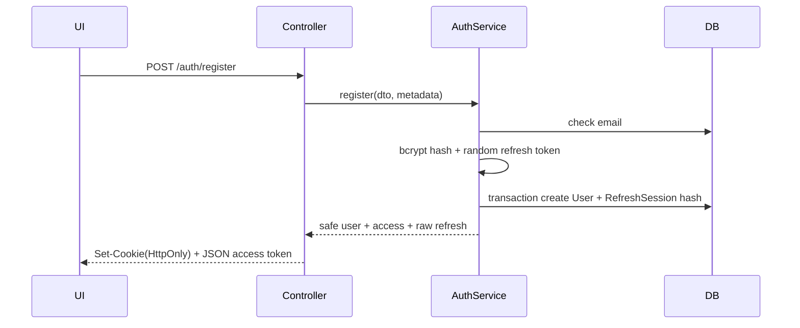
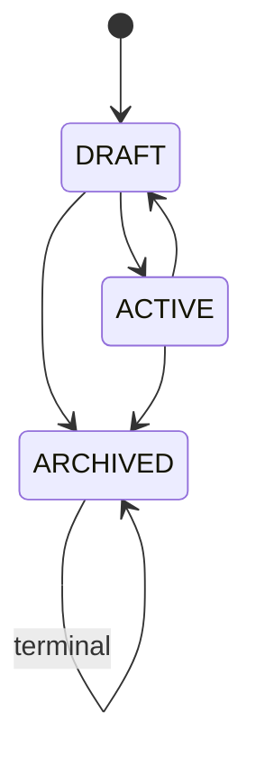
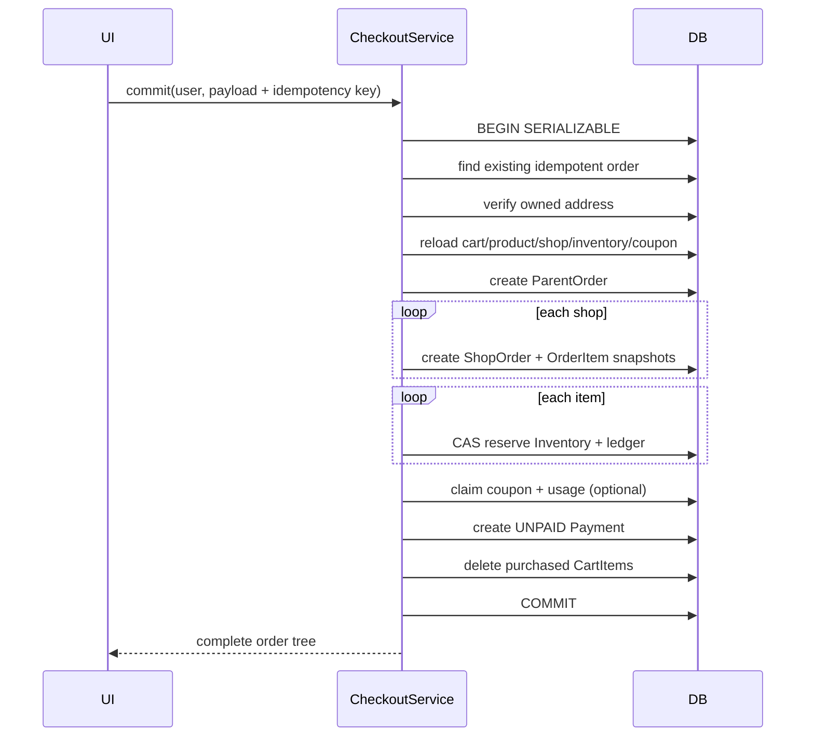
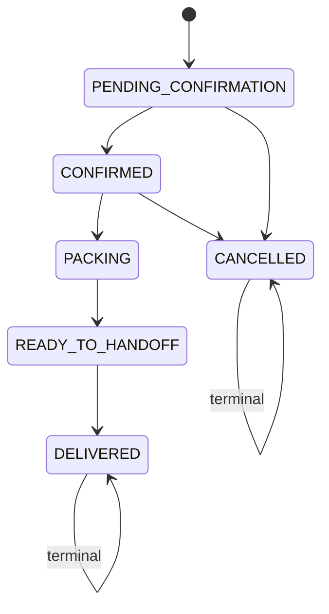

# Codebase Handbook - Multi-Vendor Commerce Platform

Last updated: 2026-08-17

Tài liệu này giải thích code và luồng chạy hiện tại của dự án cho developer mới, đặc biệt là fresher. Đây không phải tài liệu ý tưởng: nội dung bám theo source code đến Phase 5F role-aware frontend completion hiện tại.

Khi code thay đổi, tài liệu này phải được cập nhật cùng task. Không để tài liệu mô tả endpoint, trạng thái hoặc invariant đã khác với code.

---

## 1. Cách sử dụng tài liệu

Nếu mới vào dự án, đọc theo thứ tự:

1. Kiến trúc và cấu trúc thư mục.
2. Request lifecycle của backend.
3. Data model và các invariant cốt lõi.
4. Authentication/RBAC.
5. Luồng chức năng đang cần sửa.
6. Testing, debug và checklist thêm chức năng.

Khi trace một API, luôn đi theo hướng:

```text
Browser/UI
  -> lib/api.ts
  -> HTTP route
  -> Guard
  -> DTO + ValidationPipe
  -> Controller
  -> Service
  -> Prisma query/transaction
  -> PostgreSQL
  -> JSON response
  -> React state/UI
```

Không bắt đầu sửa service trước khi hiểu:

- Ai được phép gọi chức năng?
- Input được DTO validate như thế nào?
- Bảng nào bị đọc/ghi?
- Có cần transaction không?
- Invariant nào phải giữ?
- Nếu hai request chạy đồng thời thì chuyện gì xảy ra?
- Test nào chứng minh hành vi đó?

---

## 2. Trạng thái hiện tại của hệ thống

Đã chạy thật:

- Authentication bằng access JWT và opaque refresh token.
- Refresh-session retention cleanup và browser memory-only access token.
- RBAC cho customer, vendor, admin.
- Profile và address.
- Shop onboarding và admin review.
- Category management.
- Public catalog và vendor product management.
- Inventory và inventory ledger.
- Cart.
- Checkout quote và checkout commit.
- Coupon evaluation trong checkout.
- Coupon campaign administration, vendor self-service, customer discovery và per-customer usage limits.
- Parent order, shop order và order item snapshot.
- Customer order history/cancel.
- Vendor fulfillment.
- Payment record, payment state transition và audit history.
- Signed bank-transfer webhook, replay protection, bank-transfer refund transaction và explicit offline COD refund.
- Admin refund operations UI và customer refund visibility trong order detail.
- Persisted notification inbox qua transactional outbox, idempotent worker và read/unread state.
- Review sau khi giao hàng, public review aggregate và customer review UI.
- Polling order status 15 giây cho customer/vendor.
- Request ID, security headers, structured errors, HTTP timing logs và Redis distributed rate limiting.
- Database/Redis-aware readiness endpoint, full commerce e2e, CI, container images, operational drills và provider-neutral staging workflow.
- Web CSP, browser security headers và Web unit-test suite.
- Customer/vendor/admin UI tương ứng.

Chưa hoàn thiện hoặc mới là placeholder:

- Signed webhook hiện dùng contract provider-neutral; adapter map payload riêng của SePay/VNPay/MoMo và reconciliation job vẫn chưa có.
- Redis đang được dùng cho distributed rate limiting; RabbitMQ chưa publish/consume message.
- Rate limiter đã chia sẻ quota qua Redis; fixed-window vẫn có thể burst ở biên window và cần managed Redis HA khi production fail-closed.
- CSP static/Turbopack vẫn cần `unsafe-inline`; strict nonce/SRI policy còn phụ thuộc hỗ trợ ổn định từ Next.js hoặc quyết định đổi rendering/bundler.
- Staging workflow đã có contract build/push/migrate/rollout/smoke; webhook rollout, database URL và GitHub Environment secrets vẫn phải được cấu hình theo hosting thực tế.

Không được mô tả các mục “chưa hoàn thiện” như tính năng production-ready.

---

## 3. Kiến trúc tổng thể

### 3.1 Monorepo

```text
intern_project/
├── apps/
│   ├── api/                 NestJS backend
│   │   ├── prisma/          Schema, migrations, seed
│   │   └── src/             Modules và bootstrap
│   └── web/                 Next.js App Router frontend
│       ├── app/             Route pages
│       ├── components/      UI dùng chung
│       └── lib/             API/session helpers
├── packages/
│   └── shared/              Nơi dành cho shared types/constants
├── docs/                    Tài liệu kỹ thuật và kế hoạch
└── .agents/                 Quy tắc làm việc của coding agent
```

Root `package.json` dùng npm workspaces. Vì vậy lệnh ở root có thể gọi từng workspace:

```bash
npm run lint
npm run build
npm test -w @intern-project/api
```

### 3.2 Backend: modular monolith

Backend là một process NestJS nhưng chia theo bounded context:

- `auth`: danh tính và session.
- `users`: profile/address.
- `shops`: onboarding và ownership.
- `catalog`: category/product.
- `inventory`: stock và ledger.
- `cart`: giỏ hàng.
- `checkout`: pricing và tạo đơn nguyên tử.
- `coupons`: campaign lifecycle, schedule và usage policy.
- `orders`: fulfillment.
- `payments`: payment state.
- `reviews`: review eligibility, ownership và public aggregate.

“Modular monolith” nghĩa là deploy chung nhưng boundary logic vẫn rõ. Không được query/chỉnh dữ liệu domain khác tùy tiện nếu có thể gọi service sở hữu domain đó. Ví dụ `CatalogService` dùng `ShopsService.assertOwner()` để kiểm tra shop ownership.

### 3.3 Frontend: workflow-first Next.js

Frontend dùng Next.js App Router. Các page tương tác là client component vì cần local state, browser fetch/cookie flow và gọi API trực tiếp; dashboard landing không cần state vẫn có thể là server component.

Không có state-management library toàn cục. Mỗi page quản lý:

- `loading`
- `error`
- dữ liệu trả về
- trạng thái form/submitting

`apps/web/lib/api.ts` là điểm chung cho URL API, Bearer token, refresh retry, error parsing và format tiền.

`apps/web/components/AppShell.tsx` và `apps/web/lib/navigation.ts` tạo ba trải nghiệm tách biệt trên cùng ứng dụng:

- Customer storefront: header mua sắm, catalog, giỏ hàng, đơn mua và thông báo.
- Vendor workspace: sidebar riêng cho cửa hàng, sản phẩm, đơn bán và khuyến mãi.
- Admin workspace: sidebar riêng cho user, shop, category, coupon và refund.

Việc tách shell giúp user không nhìn thấy một menu trộn lẫn mọi actor. Đây là lớp UX; JWT guard, RolesGuard và ownership check ở API vẫn là lớp authorization bắt buộc.

### 3.4 Infrastructure

Docker Compose cung cấp:

| Service | Host port | Vai trò hiện tại |
|---|---:|---|
| PostgreSQL 16 | 5433 | Database chính, đang dùng thật |
| Redis 7 | 6380 | Shared atomic counter cho distributed rate limiter |
| RabbitMQ | 5673 | Hạ tầng async chuẩn bị, chưa nối business flow |
| RabbitMQ UI | 15673 | Trang quản trị RabbitMQ |

Redis hiện là critical request-protection dependency khi cấu hình fail-closed. RabbitMQ vẫn chỉ được thêm vào business flow khi có yêu cầu rõ về event, failure handling và test.

### 3.5 Environment variables

| Biến | App | Ý nghĩa | Default/fallback trong code |
|---|---|---|---|
| `DATABASE_URL` | API/Prisma | PostgreSQL connection string | Bắt buộc cho Prisma |
| `REDIS_URL` | API | Redis connection cho distributed limiter | Bắt buộc khi store là `redis` |
| `RABBITMQ_URL` | API | RabbitMQ connection chuẩn bị | Chưa được business module dùng |
| `JWT_ACCESS_SECRET` | API | Secret ký/verify access JWT | `change_me_access`, chỉ chấp nhận local |
| `JWT_ACCESS_TTL` | API | Thời gian sống access token | `15m` |
| `REFRESH_TOKEN_TTL_DAYS` | API | Cookie/session refresh TTL | `30` ngày |
| `REFRESH_SESSION_CLEANUP_ENABLED` | API | Bật maintenance cleanup | `true` |
| `REFRESH_SESSION_CLEANUP_INTERVAL_MS` | API | Khoảng chạy cleanup | `21600000` (6 giờ), tối thiểu 1 phút |
| `REFRESH_SESSION_RETENTION_DAYS` | API | Giữ session terminal sau expire/revoke để điều tra | `7` ngày |
| `REFRESH_SESSION_CLEANUP_BATCH_SIZE` | API | Số row tối đa mỗi batch | `500`, cap `5000` |
| `REFRESH_SESSION_CLEANUP_MAX_BATCHES` | API | Số batch tối đa mỗi run | `10`, cap `100` |
| `FRONTEND_URL` | API | CORS allowed origin | `http://localhost:3000` |
| `PORT` | API | API listen port | `3005` |
| `SHIPPING_FEE_PER_SHOP` | API | Phí ship fixed cho mỗi shop khi quote | `30000` |
| `RATE_LIMIT_MAX` | API | Số request tối đa mỗi IP/window | `300` |
| `RATE_LIMIT_WINDOW_MS` | API | Độ dài rate-limit window | `60000` |
| `RATE_LIMIT_STORE` | API | `redis` dùng quota chung hoặc `memory` chỉ cho local/unit | Tự chọn `redis` nếu có `REDIS_URL`, ngược lại `memory` |
| `RATE_LIMIT_FAILURE_MODE` | API | Redis lỗi thì `closed` trả 503 hay `open` cho qua | `open`; production khuyến nghị set rõ `closed` |
| `RATE_LIMIT_KEY_PREFIX` | API | Namespace Redis theo app/environment | `intern-commerce:rate-limit` |
| `RATE_LIMIT_REDIS_CONNECT_TIMEOUT_MS` | API | Timeout kết nối limiter tới Redis | `1000` |
| `TRUST_PROXY_HOPS` | API | Số reverse proxy đáng tin trước API | `0` |
| `BANK_TRANSFER_PROVIDER` | API | Stable provider namespace dùng cho unique reference/event | `bank-transfer` |
| `BANK_TRANSFER_WEBHOOK_SECRET` | API | HMAC-SHA256 secret xác thực raw webhook body | Bắt buộc để bật webhook |
| `PAYMENT_WEBHOOK_TOLERANCE_SECONDS` | API | Cửa sổ chống replay theo timestamp | `300` giây, tối thiểu `30` |
| `NEXT_PUBLIC_API_URL` | Web | Base URL browser gọi API | `http://localhost:3005/api` |

Không dùng fallback secret trong production. Secret và database URL thật không được commit.

### 3.6 Chạy local lần đầu

```bash
npm install
docker compose up -d
npm run prisma:generate -w @intern-project/api
npm run prisma:migrate -w @intern-project/api
npm run prisma:seed -w @intern-project/api
npm run dev
```

URL mặc định:

- Web: `http://localhost:3000`.
- API: `http://localhost:3005/api`.
- Health: `http://localhost:3005/api/health`.
- RabbitMQ management: `http://localhost:15673`.

Nếu sửa schema, generate lại Prisma Client trước khi build/test để TypeScript nhìn thấy model/field mới.

---

## 4. Backend request lifecycle

### 4.1 Bootstrap

Entry point: `apps/api/src/main.ts`.

Luồng khởi động:

1. `NestFactory.create(AppModule, { rawBody: true })` tạo dependency graph và giữ đúng bytes webhook để verify HMAC.
2. Lấy `ConfigService`.
3. Gọi `configureApp(app)`.
4. Listen tại `PORT`, mặc định `3005`.

`AppModule` import `ConfigModule`, `PrismaModule` và tất cả business modules.

### 4.2 Global configuration

`configure-app.ts` thiết lập:

- Prefix `/api` cho mọi route.
- Trusted proxy hops khi `TRUST_PROXY_HOPS > 0` để Express xác định client IP đúng.
- Request-context middleware sinh/validate `x-request-id` và thêm security headers.
- Fixed-window rate limiter theo IP với Redis atomic shared quota.
- `cookie-parser` để đọc refresh cookie.
- CORS chỉ cho `FRONTEND_URL`, mặc định `http://localhost:3000`.
- `credentials: true` để browser gửi HttpOnly cookie cross-origin giữa hai local port.
- Global `ValidationPipe`.
- Global request logging middleware.
- Global structured exception filter.

ValidationPipe có ba option quan trọng:

- `whitelist: true`: loại field không có decorator DTO.
- `forbidNonWhitelisted: true`: thực tế sẽ reject field lạ thay vì âm thầm bỏ qua.
- `transform: true`: cho phép class-transformer đổi query string thành number khi DTO dùng `@Type(() => Number)`.

Fresher thường mắc lỗi thêm field vào request nhưng quên thêm vào DTO; request sẽ bị `400` trước khi vào controller.

#### 4.2.1 Luồng distributed rate limiting

Code chính nằm ở `common/middleware/rate-limit.middleware.ts`. `RateLimitMiddleware` là Nest provider trong `AppModule`; `configureApp()` lấy đúng provider đó từ dependency-injection container rồi bind vào Express. `HealthController` cũng inject cùng instance để readiness và request path nhìn cùng store/lifecycle.

Luồng một request thường:

```text
request
  -> bỏ qua nếu OPTIONS hoặc health probe
  -> Express resolve request.ip (phụ thuộc TRUST_PROXY_HOPS)
  -> SHA-256(client IP)
  -> Redis key = prefix + hash
  -> Lua: INCR -> first-write PEXPIRE -> PTTL
  -> count <= limit: set quota headers, gọi next()
  -> count > limit: 429 TOO_MANY_REQUESTS + Retry-After
```

Lua script rất quan trọng. Nếu code chạy `GET`, tính ở Node rồi `SET`, hai replica có thể cùng đọc một giá trị và cùng cho request qua. `INCR` là atomic trong Redis; đặt expiry trong cùng script bảo đảm request đầu tiên vừa tạo counter vừa tạo TTL. `PTTL` trả thời gian còn lại để API tính `X-RateLimit-Reset` và `Retry-After`.

Key không chứa IP thô. Middleware hash IP rồi mới ghép với `RATE_LIMIT_KEY_PREFIX`. Prefix phải khác giữa production/staging/test nếu dùng chung Redis; nếu không, các môi trường sẽ trừ quota của nhau. Hash chỉ giảm việc lộ trực tiếp IP trong key, không thay thế policy bảo vệ dữ liệu/log.

Hai store được hỗ trợ:

- `redis`: dùng production/CI để mọi replica chia sẻ quota.
- `memory`: Map cục bộ, chỉ phù hợp unit test hoặc local không có Redis; nhiều process sẽ không chia sẻ quota.

Khi Redis lỗi:

- `failureMode=closed`: trả structured `503 RATE_LIMIT_UNAVAILABLE`, không gọi controller. Đây là policy chặt được khuyến nghị khi abuse protection là bắt buộc.
- `failureMode=open`: cho request đi tiếp, đặt `X-RateLimit-Policy: bypass` và ghi structured warning. Đây là lựa chọn availability có chủ đích, không phải trạng thái “vẫn được bảo vệ”.

Khi Redis hoạt động, response luôn có `X-RateLimit-Policy: enforced`, limit, remaining và reset. Health/OPTIONS được bỏ qua để load balancer vẫn probe được trong lúc limiter lỗi.

Readiness `/api/health/ready` ping PostgreSQL rồi ping limiter store:

- Cả hai up: `200`, `status=ready`.
- Redis down + fail-open: `200`, `status=ready_degraded`, để instance vẫn nhận traffic theo policy availability.
- Redis down + fail-closed: `503`; instance không nên nhận traffic vì mọi business request cũng sẽ bị 503.

`RedisRateLimitStore` dùng lazy connection và một shared `connectPromise`. Các request đến đồng thời trong lúc client đang connect phải await cùng promise; không được tự kết luận trạng thái `connecting` là lỗi. `onModuleDestroy()` đóng client để test/process shutdown không giữ socket.

Các lỗi thường gặp:

- Tất cả user có chung quota: kiểm tra `TRUST_PROXY_HOPS`; API có thể đang thấy IP của reverse proxy.
- Quota không chung giữa replicas: kiểm tra tất cả replica cùng `REDIS_URL`, prefix và `RATE_LIMIT_STORE=redis`.
- Readiness 503 dù PostgreSQL up: xem object `rateLimit` và Redis connectivity; không bỏ dependency khỏi readiness nếu đang fail-closed.
- Local test báo connection closed trong sandbox: xác minh Redis container/port và quyền local-network của môi trường test trước khi sửa thuật toán.
- Redis có nhiều key test: integration test dùng prefix ngẫu nhiên và TTL 5 giây nên key tự hết hạn; không dùng production prefix trong load test.

### 4.3 Module, controller, service, DTO

Vai trò từng lớp:

- Module: đăng ký controller/provider và dependency giữa bounded contexts.
- Controller: map HTTP, guard, param, body; không chứa business logic phức tạp.
- DTO: validate boundary input.
- Service: ownership, business rule, transaction, query.
- PrismaService: kết nối database và cung cấp Prisma Client.

Controller tốt trong dự án thường chỉ có dạng:

```ts
@Patch('resource/:id')
update(@CurrentUser() user, @Param('id') id, @Body() dto) {
  return this.service.update(user.sub, id, dto);
}
```

### 4.4 Prisma lifecycle

`PrismaService` extends `PrismaClient`:

- `onModuleInit()` gọi `$connect()`.
- `onModuleDestroy()` gọi `$disconnect()`.

Trong transaction callback, dùng `tx`, không dùng `this.prisma`, để tất cả write thuộc cùng transaction.

Sai:

```ts
await prisma.$transaction(async (tx) => {
  await tx.order.create(...);
  await prisma.inventory.update(...); // nằm ngoài transaction
});
```

Đúng:

```ts
await prisma.$transaction(async (tx) => {
  await tx.order.create(...);
  await tx.inventory.update(...);
});
```

### 4.5 Global hardening pipeline

Thứ tự quan trọng:

```text
HTTP request
  -> requestContextMiddleware
  -> requestLoggingMiddleware
  -> RateLimitMiddleware
  -> cookieParser/CORS
  -> Nest guards + ValidationPipe
  -> controller/service
  -> StructuredExceptionFilter nếu lỗi
```

Request context:

- Chấp nhận `x-request-id` từ upstream chỉ khi khớp `[A-Za-z0-9._-]` và dài tối đa 100.
- Nếu không hợp lệ, sinh UUID.
- Trả lại request ID trong response header.
- Thêm `X-Content-Type-Options: nosniff`, `X-Frame-Options: DENY`, `Referrer-Policy: no-referrer`.

Rate limiting:

- Bucket theo client IP.
- Default 300 request/60 giây.
- Bỏ qua OPTIONS và liveness health.
- Trả remaining/reset headers.
- Khi vượt limit, trả structured `429 TOO_MANY_REQUESTS` và `Retry-After`.
- Bucket hiện nằm trong memory; không bảo vệ quota toàn cluster nhiều replica.

Structured error shape:

```json
{
  "statusCode": 400,
  "code": "BAD_REQUEST",
  "message": "Actionable message",
  "requestId": "uuid",
  "timestamp": "ISO-8601",
  "path": "/api/resource"
}
```

Business exception có thể thêm `details`, ví dụ danh sách cart item lỗi. Unknown exception trả message generic cho client nhưng server log giữ stack kèm request ID.

Request logger dùng response `finish` event nên bao phủ cả matched routes, 404 chưa match và 429 từ middleware. Log gồm method, path, status, duration, user ID và role; không ghi body, password, cookie hoặc Authorization header. Express framework fingerprint `X-Powered-By` bị tắt.

Health endpoints:

- `GET /health`: liveness của HTTP process, không phụ thuộc DB.
- `GET /health/ready`: chạy `SELECT 1`, chỉ ready khi PostgreSQL truy cập được.

---

## 5. Authentication, authorization và ownership

Ba khái niệm khác nhau:

- Authentication: request này là của user nào?
- Role authorization: role này có được gọi route không?
- Resource ownership: resource cụ thể có thuộc user này không?

JWT guard chỉ giải quyết authentication. RolesGuard chỉ giải quyết role. Service vẫn phải kiểm tra ownership.

Ví dụ vendor A và vendor B đều có role `VENDOR`; RolesGuard cho cả hai qua route sửa product. `CatalogService.assertProductOwner()` mới ngăn vendor B sửa product của vendor A.

### 5.1 Access token

Access token payload:

```json
{
  "sub": "user UUID",
  "email": "user@example.com",
  "role": "CUSTOMER | VENDOR | ADMIN"
}
```

`JwtStrategy` đọc `Authorization: Bearer <token>`, verify secret/expiry, sau đó đọc lại user hiện tại từ PostgreSQL. User không còn tồn tại hoặc đã `BANNED` nhận `401` ngay cả khi JWT chưa hết hạn; role gán vào `request.user` cũng lấy từ database thay vì claim cũ. Vì vậy approve shop có thể nâng role CUSTOMER thành VENDOR mà request kế tiếp không phải chờ access token cũ hết hạn, đồng thời thao tác ban có hiệu lực ngay. Đổi lại, mọi protected request có thêm một identity query; khi scale phải theo dõi latency/connection pool và chỉ cache nếu vẫn bảo đảm revocation tức thời.

`@CurrentUser()` lấy `request.user` để controller truyền `sub` xuống service.

### 5.2 RolesGuard

`@Roles(...)` ghi metadata. `RolesGuard` đọc metadata ở method/class:

1. Không có role requirement thì cho qua.
2. Có requirement thì kiểm tra `request.user.role` nằm trong danh sách.

Thứ tự guard thường là:

```ts
@UseGuards(JwtAuthGuard, RolesGuard)
```

JWT phải chạy trước để RolesGuard có `request.user`.

### 5.3 Ownership pattern

Các ownership check đang có:

- Shop: `ShopsService.assertOwner(shopId, ownerId)`.
- Product: `CatalogService.assertProductOwner(productId, ownerId)`.
- Inventory: đọc product -> shop -> owner.
- Address: query `where: { id: addressId, userId }`.
- Customer order: query `where: { id: orderId, userId }`.
- Vendor shop order: đọc shop order kèm shop và so `shop.ownerId`.

Ưu tiên filter ownership ngay trong query nếu có thể. Nó tránh trả về resource của người khác rồi mới xử lý.

---

## 6. Data model và quan hệ nghiệp vụ

### 6.1 Identity

```text
User 1 --- n UserAddress
User 1 --- n RefreshSession
User 1 --- n Shop
User 1 --- 1 Cart (unique userId)
User 1 --- n WishlistItem
User 1 --- n ParentOrder
```

- `User.passwordHash` không bao giờ được trả về API.
- `RefreshSession.tokenHash` lưu SHA-256, không lưu raw token.
- `UserAddress.isDefault` được service cố giữ đúng một địa chỉ mặc định nếu user có địa chỉ.

### 6.2 Catalog và inventory

```text
Shop 1 --- n Product
Category 1 --- n Product
Category 1 --- n Category (self hierarchy)
Product 1 --- 1 Inventory
Inventory 1 --- n InventoryLedger
```

Ba số stock:

- `onHand`: số vật lý hệ thống ghi nhận.
- `reserved`: số đã giữ cho order nhưng chưa hoàn tất.
- `sold`: số đã giao/bán hoàn tất.

Công thức duy nhất cho stock có thể bán:

```text
available = onHand - reserved
```

Không tạo cột `available`, vì nó là derived value và dễ lệch dữ liệu.

### 6.3 Cart

```text
User 1 --- 1 Cart
Cart 1 --- n CartItem
CartItem n --- 1 Product
```

Unique `(cartId, productId)` bảo đảm một product chỉ có một dòng trong cart. Add lại cùng product sẽ cộng quantity.

Cart không snapshot giá. Giá trong cart chỉ là preview; checkout luôn đọc lại Product hiện tại.

### 6.4 Order

```text
User
  └── ParentOrder (một lần checkout)
        ├── ShopOrder (phần của shop A)
        │     └── OrderItem snapshots
        ├── ShopOrder (phần của shop B)
        │     └── OrderItem snapshots
        ├── Payment
        │     ├── PaymentStatusHistory
        │     ├── Refund
        │     │     └── RefundStatusHistory
        │     └── PaymentWebhookEvent
        └── CouponUsage
```

Lý do tách:

- Customer trả tiền/xem tổng theo ParentOrder.
- Mỗi vendor chỉ fulfill ShopOrder của mình.
- Shop A có thể cancel trong khi shop B vẫn delivered.
- Payment status không bị trộn với fulfillment status.
- Refund là transaction riêng; không sửa/xóa lịch sử Payment hoặc PaymentStatusHistory cũ.
- Unique `(provider, providerRef)` và `(provider, eventId)` chặn cùng giao dịch/event provider được ghi cho hai payment.

`OrderItem` lưu `productName`, `productImage`, `unitPrice`, `quantity`, `lineTotal`. Sau khi product đổi tên/giá/ảnh, order cũ vẫn giữ đúng lịch sử mua.

### 6.5 Wishlist

```text
User 1 --- n WishlistItem n --- 1 Product
```

Unique `(userId, productId)` là invariant ở database, không chỉ là kiểm tra frontend. Vì vậy hai request thêm đồng thời vẫn chỉ tạo một item. `WishlistItem` chỉ lưu quan hệ và `createdAt`; tên, giá, ảnh, shop và tồn kho luôn đọc từ Product hiện tại để người dùng không nhìn dữ liệu thương mại đã cũ.

Xóa User hoặc Product cascade WishlistItem vì item không còn giá trị độc lập. Wishlist không reserve stock, không snapshot giá và không thay thế Cart.

### 6.6 Money

Database dùng `Decimal(12,2)` và code dùng `Prisma.Decimal`.

Không dùng JavaScript floating point cho phép tính order. Ví dụ `0.1 + 0.2` không chính xác trong IEEE floating point. Convert sang number chỉ ở UI format/display khi phù hợp.

---

## 7. Luồng đăng ký tài khoản

Endpoint: `POST /api/auth/register`

Input chính:

- `email`: email hợp lệ.
- `password`: tối thiểu 8 ký tự.
- `fullName`.
- `phone`: optional.
- `role`: DTO nhận enum nhưng service chỉ chấp nhận `CUSTOMER`.

Luồng:

1. Global ValidationPipe validate `RegisterDto`.
2. `AuthController.register()` lấy body và metadata request.
3. `AuthService.register()` kiểm tra email trùng.
4. Nếu client cố đăng ký `VENDOR`/`ADMIN`, trả `400`.
5. Hash password bằng bcrypt cost 12.
6. Sinh refresh token random 48 bytes dạng base64url.
7. Mở transaction:
   - tạo User;
   - hash refresh token bằng SHA-256;
   - tạo RefreshSession.
8. Ký access JWT.
9. Controller set raw refresh token vào HttpOnly cookie.
10. Response chỉ trả safe user và access token.



Tại frontend, `/register` giữ `{accessToken, user}` trong module memory rồi chuyển về storefront `/`. Customer chỉ mở `/vendor/shop` khi chủ động chọn Kênh người bán; user không tự nâng role.

---

## 8. Luồng login, refresh và logout

### 8.1 Login

Endpoint: `POST /api/auth/login`.

1. Tìm user theo email.
2. Dùng bcrypt compare password.
3. Reject nếu account không `ACTIVE`.
4. Sinh refresh token mới và tạo RefreshSession.
5. Trả access token; refresh token nằm trong HttpOnly cookie.

Thông báo “Invalid credentials” cố tình giống nhau cho email không tồn tại và password sai, tránh user enumeration.

### 8.2 Frontend authenticated request

`apiRequest(path, init, true)`:

1. Đọc session từ module memory.
2. Nếu memory trống sau reload, gọi `/auth/refresh` bằng HttpOnly cookie để khôi phục session.
3. Gắn `Authorization: Bearer ...`.
4. Gọi fetch với `credentials: include`.
5. Nếu response `401` khi request bắt đầu bằng token cũ, gọi refresh đúng một lần.
6. Lưu access token mới vào memory.
7. Retry request gốc một lần; không tạo vòng lặp refresh vô hạn.

Biến module-level `refreshRequest` chống nhiều request cùng lúc tạo nhiều refresh call. Các request cùng chờ một Promise.

### 8.3 Refresh token rotation

Endpoint: `POST /api/auth/refresh`.

1. Browser tự gửi cookie vì `credentials: include`.
2. Service hash raw token.
3. Tìm RefreshSession theo hash.
4. Reject nếu không có, revoked, expired hoặc user inactive.
5. Sinh token kế tiếp.
6. Trong transaction, `updateMany` session cũ với điều kiện `revokedAt: null`.
7. Nếu count khác 1, token đã được dùng/race -> reject.
8. Tạo session mới và set cookie mới.

Đây là rotation: mỗi refresh token chỉ dùng một lần.

### 8.4 Logout

- `POST /auth/logout`: revoke session tương ứng cookie hiện tại, clear cookie.
- `POST /auth/logout-all`: cần JWT, revoke mọi active session của user, clear cookie hiện tại.

Frontend còn gọi `clearSession()` để xóa access token/user khỏi memory và xóa legacy localStorage key nếu còn từ release cũ.

Security note: refresh token nằm trong HttpOnly cookie và access token chỉ ở memory. Điều này giảm token tồn tại sau reload/browser restart nhưng không chống được script XSS đang chạy trong chính page; CSP và output/dependency hygiene vẫn bắt buộc.

### 8.5 Refresh-session cleanup

Provider: `RefreshSessionCleanupService` trong Auth module.

Mục tiêu là giới hạn tăng trưởng bảng `refresh_sessions` nhưng vẫn giữ session expired/revoked gần đây để debug incident hoặc truy dấu reuse. Cleanup không xóa session active và không xóa terminal session chưa qua retention.

Luồng mỗi lần chạy:

```text
bootstrap hoặc interval
  -> tính cutoff = now - retention days
  -> mở PostgreSQL transaction
  -> pg_try_advisory_xact_lock(stable lock id)
  -> không lấy được lock: replica khác đang chạy, kết thúc không lỗi
  -> CTE chọn tối đa batchSize terminal rows
  -> FOR UPDATE SKIP LOCKED
  -> DELETE ... RETURNING id
  -> lặp tối đa maxBatches hoặc dừng khi batch chưa đầy
  -> commit và tự nhả transaction advisory lock
```

Session đủ điều kiện khi `expiresAt <= cutoff` hoặc `revokedAt <= cutoff`. Cleanup theo batch để không tạo một transaction xóa không giới hạn. `SKIP LOCKED` tránh chờ row đang được transaction khác giữ; advisory lock ngăn các API replica cleanup đồng thời. Replica chạy ngay sau khi lock được nhả có thể acquire rồi no-op vì candidate đã hết; đây là scan nhỏ, không phải duplicate delete.

Job chạy ngay sau bootstrap rồi theo interval. Timer gọi `unref()` nên không giữ process/test sống; `onModuleDestroy()` clear timer. Cleanup error chỉ ghi structured `refresh_session_cleanup_error`, không làm API startup fail vì đây là maintenance path, không phải request invariant. Operations phải alert lỗi lặp lại vì table sẽ tiếp tục tăng.

Integration test tạo bốn loại row: expired cũ, revoked cũ, expired gần đây và active; chỉ hai row terminal quá retention được xóa. Test thứ hai giữ advisory lock ở transaction khác và xác minh worker cạnh tranh trả `acquired=false` mà không xóa.

---

## 9. Luồng profile và address

Tất cả route nằm dưới `/api/users/me` và cần JWT.

### 9.1 Profile

- `GET /users/me`: select safe fields.
- `PATCH /users/me`: update `fullName`, `phone`.

Service dùng `SAFE_USER_SELECT`, vì trả thẳng model User sẽ lộ `passwordHash`.

### 9.2 Tạo address

Endpoint: `POST /users/me/addresses`.

Transaction:

1. Đếm address hiện tại.
2. Address đầu tiên luôn default.
3. Nếu request chọn default, unset default cũ.
4. Tạo address mới.

### 9.3 Đổi default

Endpoint: `PATCH /users/me/addresses/:addressId`.

- Query theo cả `id` và `userId` để enforce ownership.
- Không cho unset trực tiếp default hiện tại, vì có thể tạo trạng thái không default.
- Khi set một address thành default, unset các address default khác trong cùng transaction.

### 9.4 Xóa address

Endpoint: `DELETE /users/me/addresses/:addressId`.

Nếu xóa default:

1. Xóa address.
2. Tìm address còn lại mới nhất.
3. Set nó thành default.

Checkout chỉ nhận address thuộc đúng customer và snapshot nội dung address vào ParentOrder. Sửa address profile sau đó không sửa địa chỉ của order cũ.

### 9.5 Frontend nhập địa chỉ và bản đồ

`components/AddressForm.tsx` là form dùng chung cho `/profile` và phần thêm nhanh trong `/cart`. Toàn bộ label, placeholder và feedback chính được viết bằng tiếng Việt. Form giữ `AddressDraft` gồm `recipient`, `phone`, `line1`, `ward`, `district`, `city`; đây cũng chính là shape backend nhận nên UI không tự tạo một address model thứ hai.

Luồng nhập tay vẫn luôn hoạt động. `AddressMapPicker` chỉ là công cụ hỗ trợ:

```text
Người dùng nhập từ khóa và bấm Tìm
  -> browser gọi same-origin /api/geocoding/search
  -> Next route validate input và gọi Nominatim /search ở server
  -> giới hạn Việt Nam, tiếng Việt và 5 kết quả
  -> chọn kết quả
  -> addressDraftFromPlace() chuẩn hóa road/ward/district/city
  -> mergeLocatedAddress() chỉ ghi đè field provider trả về
  -> người dùng kiểm tra/sửa input
  -> POST /users/me/addresses
```

Khi bấm một điểm trên bản đồ, UI đặt `circleMarker`, gọi same-origin `/api/geocoding/reverse`; Next route validate biên latitude/longitude rồi mới gọi Nominatim `/reverse`. Kết quả đi qua cùng hàm chuẩn hóa. Không lưu latitude/longitude vào database trong scope hiện tại; thông tin chính thức vẫn là các ô địa chỉ và checkout snapshot chúng như trước. Nếu Leaflet, tile hoặc geocoder lỗi, map hiện cảnh báo nhưng input và nút lưu không bị khóa.

Map dùng Leaflet, tile `https://tile.openstreetmap.org/{z}/{x}/{y}.png` và attribution OpenStreetMap hiển thị trực tiếp. Browser không gọi Nominatim cross-origin; hai Next Route Handler là proxy có allowlist cố định, không nhận upstream URL từ client. `lib/geocoding.ts` validate input, gửi `GEOCODING_USER_AGENT`, queue tối đa một upstream request mỗi giây trong mỗi process và cache kết quả 24 giờ; response route cho browser cache một giờ. Nominatim public không được dùng làm autocomplete: chỉ request khi submit/click. `countrycodes=vn` là filter địa lý; `accept-language=vi` ưu tiên tên tiếng Việt. Đây phù hợp demo/local có lưu lượng nhỏ. Production có nhiều replica/traffic phải dùng managed/self-hosted geocoder/tile provider và distributed rate limit/cache, giữ attribution, privacy và quota theo hợp đồng; không preload/bulk download public OSM tiles.

`AddressForm` đã là form chịu trách nhiệm lưu địa chỉ, vì vậy `AddressMapPicker` tuyệt đối không render thêm thẻ `<form>` bên trong. Thanh tìm kiếm map dùng container thường và nút `type="button"`; handler `keydown` chặn default khi Enter rồi gọi search. Nếu lồng form hoặc bỏ `type="button"`, browser có thể submit form cha, reload trang và không chạy/không hiển thị kết quả geocoder. Regression test render component thành static markup để khóa invariant không có nested form này.

### 9.6 Admin quản trị user

Ba endpoint `/admin/users` chỉ cho `ADMIN`:

- `GET /admin/users`: search tên/email/phone, filter role/status và paginate; response dùng `SAFE_USER_SELECT`, tuyệt đối không trả `passwordHash`, refresh session hay credential.
- `GET /admin/users/:userId`: thêm shop sở hữu, thống kê và 20 audit record gần nhất.
- `PATCH /admin/users/:userId/status`: chỉ nhận `ACTIVE|BANNED`; ban bắt buộc lý do.

Luồng ban chạy trong một transaction:

1. Chặn Admin tự ban chính mình và chặn ban Admin active cuối cùng.
2. Tìm mọi shop `APPROVED` của target.
3. Đổi user sang `BANNED`.
4. Revoke mọi RefreshSession chưa revoke.
5. Chuyển các shop trên sang `SUSPENDED`.
6. Ghi audit cho user, trong `after` có status mới và danh sách shop bị đình chỉ; đồng thời ghi một shop audit cho từng shop tự động chuyển trạng thái để lịch sử shop không bị khuyết.

Access JWT cũ bị chặn bởi database status check trong `JwtStrategy`. Khi mở khóa, hệ thống chỉ đổi user về `ACTIVE`; không tự khôi phục shop vì mỗi shop cần được Admin rà soát riêng. Audit là append-only operational record; UI không cung cấp thao tác xóa. Nếu sau này thêm xóa account, phải quyết định retention/anonymization cho audit trước, không cascade âm thầm.

---

## 10. Luồng shop onboarding

### 10.1 Customer gửi shop request

Endpoint: `POST /api/shops`.

Allowed roles: `CUSTOMER`, `VENDOR`.

1. Validate name/slug.
2. Kiểm tra slug unique.
3. Tạo Shop với default status `PENDING_REVIEW`.

Tạo shop không tự biến user thành vendor.

Frontend `/vendor/shop` phải giữ `const formElement = event.currentTarget` trước request bất đồng bộ. React có thể đưa `event.currentTarget` về `null` sau `await`; vì vậy gọi `event.currentTarget.reset()` sau API sẽ báo `Cannot read properties of null (reading 'reset')` dù shop đã được tạo thành công. Helper `lib/form-submission.ts#submitAndReset` nhận form reference đã capture, chỉ reset sau khi API resolve và giữ nguyên dữ liệu khi API reject. Nút submit bị disable trong lúc gửi để hạn chế double-click; sau success trang reload `/shops/me` để request `PENDING_REVIEW` xuất hiện ngay. Admin category create dùng cùng helper vì có cùng async form lifecycle.

### 10.2 Admin quản trị shop

API chính:

- `GET /admin/shops`: tìm theo tên/slug/tên hoặc email owner, filter status và paginate.
- `GET /admin/shops/:shopId`: trả owner safe fields, thống kê, 20 product gần nhất và audit history.
- `PATCH /admin/shops/:shopId/status`: chuyển trạng thái có kiểm soát.
- Hai endpoint `/shops/admin/review-queue` và `/shops/:shopId/review` được giữ tương thích cho client cũ; mutation cũ vẫn đi qua cùng service/audit.

Đồ thị transition là whitelist: `PENDING_REVIEW -> APPROVED|REJECTED`, `APPROVED -> SUSPENDED`, `SUSPENDED -> APPROVED|REJECTED`, `REJECTED -> PENDING_REVIEW`. Reject/suspend bắt buộc lý do. Approve bị chặn nếu owner đang `BANNED`.

Khi approve, transaction update shop, nâng CUSTOMER owner thành VENDOR, ghi `AdminAuditLog` và enqueue notification. Audit lưu actor, target, trạng thái trước/sau, lý do và timestamp. JWT strategy đọc role hiện tại từ database nên request kế tiếp của owner nhìn thấy role VENDOR; client vẫn nên refresh session để UI session hiển thị role mới ngay.

### 10.3 Public shop

`GET /shops` chỉ trả shop `APPROVED` và select field public. Không trả owner internals.

---

## 11. Luồng category

### 11.1 Public tree

`GET /categories`:

1. Lấy toàn bộ category active.
2. Tạo Map `id -> node + children`.
3. Duyệt category:
   - có parent active trong map -> push vào parent.children;
   - không có parent -> trở thành root.
4. Trả tree arbitrary depth.

### 11.2 Admin create/update

- `POST /categories`
- `GET /admin/categories`
- `PATCH /categories/:categoryId`
- `PATCH /categories/:categoryId/status`

Parent validation:

- Parent phải tồn tại và active.
- Khi update parent, service đi ngược chuỗi ancestor.
- Nếu gặp chính category đang sửa, quan hệ mới sẽ tạo cycle -> reject.

Ví dụ không hợp lệ:

```text
A -> B -> C
update A.parentId = C
```

### 11.3 Deactivate category

Trước khi deactivate, service đếm song song:

- active child categories;
- product DRAFT/ACTIVE trực tiếp trong category.

Nếu còn dependency, reject. Admin phải deactivate child và archive/move product trước. Quy tắc này tránh catalog bị orphan/ngầm biến mất.

---

## 12. Luồng product/catalog

### 12.1 Public listing

Endpoint: `GET /api/products`.

Một product chỉ public khi đồng thời:

```text
Product.status == ACTIVE
Shop.status == APPROVED
Inventory.onHand > Inventory.reserved
```

Query hỗ trợ:

- `search`: contains name/description, case insensitive.
- `categoryId`.
- `page`, mặc định 1.
- `limit`, mặc định 20 và service cap tối đa 50.

Service chạy song song query items và count, trả `{items, total, page, limit}`.

`GET /products/:slug` dùng cùng visibility rule. Nếu product tồn tại nhưng draft/out-of-stock/shop suspended thì public API trả `null`, không làm lộ item private.

Frontend entry `/products/[slug]` gọi endpoint này bằng slug đã encode. `productDetailPath()` encode slug khi tạo link; `productDetailApiPath()` decode route param an toàn rồi encode đúng một lần khi gọi API. Cặp helper này tương thích cả slug chuẩn dạng `modular-desk-lamp` lẫn dữ liệu cũ có khoảng trắng/Unicode, đồng thời tránh lỗi `%20` bị encode lần hai thành `%2520`. Trang detail không dùng vendor/admin endpoint và không nhận stock/price từ route state, vì refresh hoặc deep link vẫn phải lấy server state mới nhất.

### 12.2 Vendor tạo product

Endpoint: `POST /shops/:shopId/products`, role VENDOR.

1. `assertOwner()` bảo đảm shop thuộc vendor.
2. Reject shop suspended.
3. Category phải tồn tại và active.
4. Transaction:
   - tạo Product;
   - tạo Inventory;
   - tạo ledger `INITIAL_STOCK`.

Ngay cả initial stock bằng 0 vẫn tạo ledger để có dấu vết khởi tạo.

Create DTO và form Vendor hiện nhận:

- `name`, `slug`, active `categoryId`;
- `price` và optional `compareAtPrice`;
- `description` tối đa 5.000 ký tự;
- `images`: tối đa 8 URL HTTP/HTTPS duy nhất, mỗi URL tối đa 2.048 ký tự;
- `attributes`: object tối đa 20 cặp key/value scalar;
- `initialStock` và status khởi tạo `DRAFT` từ UI.

Service yêu cầu `compareAtPrice > price` nếu có. Attribute key phải có nội dung và tối đa 60 ký tự; string value tối đa 300 ký tự; nested object/array bị reject. Product fields, Inventory và ledger ban đầu cùng nằm trong một transaction nên lỗi ở bất kỳ bước nào rollback toàn bộ.

### 12.3 Vendor update/status/archive

- `GET /shops/:shopId/products`: list sản phẩm shop của owner.
- `PATCH /products/:productId`: sửa field cho phép.
- `PATCH /products/:productId/status`: DRAFT/ACTIVE.
- `PATCH /products/:productId/archive`: archive terminal.

Invariant:

- Vendor không sửa product shop khác.
- Archived product không sửa hoặc reactivate.
- Không dùng status endpoint để archive; phải dùng archive endpoint để terminal action rõ ràng.
- Activate chỉ khi shop approved và category active.
- Edit cho phép name, slug, category, price/compare-at price, description, toàn bộ image order và attributes. Gửi `compareAtPrice=null`, `images=[]` hoặc `attributes={}` để xóa dữ liệu tương ứng.
- Update price vẫn revalidate với compare-at price hiện tại; không thể tăng price vượt giá gốc mà quên sửa/xóa giá gốc.
- Product update là một row update sau ownership/status/category/merchandising validation; không sửa Inventory trong endpoint này.

Product status flow:



---

## 13. Luồng inventory và chống race condition

### 13.1 Đọc inventory

Endpoint: `GET /inventory/products/:productId`.

- VENDOR chỉ xem product của mình.
- ADMIN xem được mọi inventory.
- Response lấy tối đa 50 ledger mới nhất và thêm derived `available`.

### 13.2 Manual adjustment

Endpoint: `PATCH /inventory/products/:productId/adjust`, role VENDOR.

Input:

- `quantity`: delta, có thể dương hoặc âm.
- `reason`: InventoryReason.
- `note`: optional.

Không overwrite stock bằng một số tuyệt đối. Service tính:

```text
nextOnHand = currentOnHand + quantity
```

Nếu `nextOnHand < reserved`, reject. Hệ thống không được có nhiều hàng reserved hơn hàng on hand.

### 13.3 Compare-and-swap

Hai request có thể cùng đọc một version inventory. Service dùng conditional update:

```ts
updateMany({
  where: {
    id,
    onHand: valueJustRead,
    reserved: valueJustRead,
  },
  data: ...,
})
```

Nếu row đã bị request khác đổi, `count === 0`. Service rollback callback result và retry tối đa 3 lần. Hết retry trả `409 Conflict`.

Đây là optimistic concurrency control, không phải mutex trong memory. Nó vẫn đúng khi chạy nhiều API instance vì cạnh tranh được giải quyết ở database.

### 13.4 Ledger

Mọi stock change phải ghi ledger trong cùng transaction với inventory update.

Ý nghĩa delta:

| Event | deltaOnHand | deltaReserve | deltaSold |
|---|---:|---:|---:|
| Initial +10 | +10 | 0 | 0 |
| Manual add +5 | +5 | 0 | 0 |
| Reserve 2 | 0 | +2 | 0 |
| Cancel 2 | 0 | -2 | 0 |
| Deliver 2 | -2 | -2 | +2 |

Nếu inventory thay đổi mà ledger không có record tương ứng, đó là bug audit nghiêm trọng.

---

### 13.5 Luồng wishlist

Wishlist dành cho user đã xác thực có role CUSTOMER hoặc VENDOR. ADMIN quản trị catalog nhưng không có hành vi mua sắm này.

Các endpoint:

- `GET /wishlist?page=1&limit=20`: danh sách đầy đủ, phân trang.
- `GET /wishlist/product-ids`: payload ID gọn để tô trạng thái heart trên Marketplace.
- `PUT /wishlist/items/:productId`: thêm idempotent.
- `DELETE /wishlist/items/:productId`: xóa idempotent.

Luồng thêm:

1. `JwtAuthGuard` xác định user; `RolesGuard` chặn role ngoài CUSTOMER/VENDOR.
2. Service đọc Product cùng status Shop.
3. Product không tồn tại trả `404`; product không ACTIVE hoặc shop không APPROVED trả `400`.
4. Prisma `upsert` theo unique `(userId, productId)`. Retry hoặc double-click không tạo bản ghi trùng.
5. Response `{ productId, wished: true }` để UI cập nhật Set cục bộ ngay.

Luồng list luôn filter `where: { userId }`, select safe product fields rồi tính:

```text
available = max(0, onHand - reserved)
isPurchasable = product ACTIVE && shop APPROVED && available > 0
```

Một product đã lưu có thể chuyển DRAFT, hết hàng hoặc shop bị suspend. Row Wishlist vẫn được giữ và list trả `isPurchasable=false`; đây là hành vi có chủ ý để user còn nhận ra lựa chọn cũ. Nút thêm giỏ bị khóa, còn Cart/Checkout vẫn revalidate độc lập nếu trạng thái đổi sau lúc render.

Remove dùng `deleteMany({ userId, productId })` và luôn trả `wished:false`. Filter user ngay trong write vừa enforce ownership vừa làm request lặp an toàn. Add/remove chỉ ghi một bảng nên không cần transaction nhiều bước; database unique constraint là lớp chống concurrency cuối cùng.

Integration test phải dùng PostgreSQL thật để chứng minh unique, ownership, trạng thái unavailable và available stock; mock service không đủ chứng minh unique constraint.

---

## 14. Luồng cart

Tất cả cart routes cần JWT và role CUSTOMER hoặc VENDOR.

### 14.1 Get cart

`GET /cart` dùng `upsert` theo unique `userId`. User chưa có cart sẽ được tạo empty cart.

Response mỗi item có:

- product/shop/category/inventory hiện tại;
- `available`;
- `lineTotal`;
- `isValid`;
- danh sách `errors`.

Cart tổng có `itemCount`, `subtotal`, `isValid`.

`isValid` chỉ true khi cart không rỗng và mọi item hợp lệ.

### 14.2 Add item

`POST /cart/items` input `{productId, quantity}`.

Transaction:

1. Upsert Cart.
2. Tìm CartItem cùng product.
3. `nextQuantity = existing + requested`.
4. Reject trên 99.
5. `assertPurchasable()`:
   - product tồn tại;
   - product ACTIVE;
   - shop APPROVED;
   - available đủ quantity mới.
6. Upsert CartItem.
7. Sau transaction, query lại và trả cart view mới.

### 14.3 Update/remove/clear

- `PATCH /cart/items/:itemId`: item phải thuộc cart user; validate stock với quantity mới.
- `DELETE /cart/items/:itemId`: deleteMany kèm `cart.userId`; count 0 -> not found.
- `DELETE /cart`: xóa tất cả item của cart user, không xóa Cart container.

Cart validation không reserve stock. Giữa lúc add cart và checkout, stock/price/shop status có thể đổi. Vì vậy checkout bắt buộc validate lại.

### 14.4 Đồng bộ badge giỏ hàng frontend

`lib/cart-indicator.ts` là external store rất nhỏ, chỉ giữ `itemCount` trong memory và phát thông báo cho `useSyncExternalStore()`. Nó không thay cart backend và không lưu localStorage.

- `AppShell` tải `GET /cart` sau khi khôi phục session CUSTOMER/VENDOR và đưa số lượng lên icon giỏ ở desktop/mobile.
- Home và product detail lấy cart response từ `POST /cart/items` rồi gọi `setCartItemCount()` ngay, nên không cần reload header.
- Trang cart cập nhật store sau load, tăng/giảm/xóa item; checkout thành công reset về 0.
- Logout, anonymous session hoặc ADMIN reset counter để không lộ số của account trước.
- Badge hiển thị tổng quantity (`itemCount`), không phải số dòng sản phẩm; trên 99 hiển thị `99+`.

Backend response vẫn là nguồn đúng. Store này chỉ giải quyết phản hồi UI tức thời và sẽ được đồng bộ lại từ `/cart` sau reload/session restore.

---

## 15. Checkout quote và pricing pipeline

Endpoint: `POST /checkout/quote`.

Input:

- `cartItemIds`: optional để tương thích client cũ; khi có phải là 1-99 UUID v4 unique và chỉ đại diện các dòng user đã chọn.
- `couponCode`: optional.

Quote không ghi database. Nó trả preview dựa trên dữ liệu hiện tại.

### 15.1 Load và revalidate cart

`loadCartItems()` lấy cart item kèm product, shop, inventory. Nếu DTO có `cartItemIds`, relation query filter ngay theo danh sách đó trong cart của current user. Service so số row tìm được với số ID request; thiếu một ID nghĩa là item không thuộc user, đã bị xóa hoặc selection stale và request bị reject. Không được im lặng checkout phần còn lại.

Mỗi item được chọn tính `lineTotal = price * quantity`. Không có `cartItemIds` thì service dùng toàn cart để giữ backward compatibility cho client/API cũ.

Mỗi item được kiểm tra:

- Product ACTIVE.
- Shop APPROVED.
- `onHand - reserved >= quantity`.

Nếu có item lỗi, service trả `BadRequestException` với message và danh sách item lỗi. Không tự bỏ item lỗi khỏi checkout, vì customer phải biết order đang khác mong đợi.

### 15.2 Group theo shop

`groupItems()` dùng Map theo `shop.id`:

```text
Cart items
  -> Shop A: item 1, item 2, subtotal A
  -> Shop B: item 3, subtotal B
```

Mỗi group sau này trở thành một ShopOrder.

### 15.3 Shipping

Phí ship hiện tại là fixed per shop:

```text
shippingPerShop = SHIPPING_FEE_PER_SHOP || 30000
totalShipping = shippingPerShop * numberOfShops
```

Đây là policy đơn giản Phase 3, chưa phải shipping provider calculation.

### 15.4 Coupon validation

Code được trim và uppercase trước khi lookup.

Check:

1. Coupon tồn tại và active.
2. Đã tới `startsAt`.
3. Chưa qua `expiresAt`.
4. `usedCount < usageLimit` nếu có limit.
5. Đếm CouponUsage theo `(couponId,userId)` và yêu cầu count nhỏ hơn `perUserLimit` nếu campaign cấu hình.
6. SHOP coupon phải có shop tương ứng trong cart.
7. Eligible subtotal đạt `minOrderAmount`.

Quote kiểm tra per-user limit để báo lỗi sớm. Commit chạy lại cùng check trong Serializable transaction. Index `(couponId,userId)` làm predicate read ổn định; nếu hai checkout cùng user/coupon cạnh tranh, PostgreSQL abort một transaction, service retry và lần sau thấy limit đã hết. CouponUsage chỉ được tạo trong cùng transaction với order.

Eligible subtotal:

- GLOBAL: toàn cart subtotal.
- SHOP: subtotal của đúng shop.

### 15.5 Tính discount

Percentage:

```text
eligibleSubtotal * value / 100
```

Fixed amount:

```text
min(eligibleSubtotal, coupon.value)
```

Sau đó áp `maxDiscount` nếu có và cap không vượt eligible subtotal. Kết quả làm tròn 2 decimal places.

GLOBAL discount được phân bổ tỷ lệ theo shop subtotal. Phần sai số rounding cuối cùng được đưa vào shop cuối để tổng allocation đúng bằng parent discount.

SHOP discount chỉ phân bổ cho shop áp dụng.

### 15.6 Quản trị coupon campaign

Actor: ADMIN hoặc VENDOR. Frontend entry: `/admin/coupons`, `/vendor/coupons`; customer discovery nằm trong `/cart`. Backend module: `modules/coupons`.

Endpoints:

- `GET /admin/coupons`: search/scope/status, pagination tối đa 100; trả shop và usage count.
- `POST /admin/coupons`: tạo GLOBAL hoặc SHOP campaign.
- `PATCH /admin/coupons/:couponId`: sửa cấu hình.
- `PATCH /admin/coupons/:couponId/status`: activate/deactivate.
- `GET /vendor/coupons`: chỉ trả SHOP campaign thuộc các shop của current vendor.
- `POST /vendor/coupons`: chỉ nhận scope SHOP và shop đã APPROVED thuộc current vendor.
- `PATCH /vendor/coupons/:couponId`: ownership được kiểm tra lại trước khi update; vendor không thể đổi thành GLOBAL hoặc chuyển sang shop người khác.
- `PATCH /vendor/coupons/:couponId/status`: activate/deactivate coupon thuộc vendor.
- `GET /coupons/available`: customer/vendor đã đăng nhập nhận tối đa 100 campaign active, đang trong schedule, chưa hết tổng lượt và chưa hết lượt của chính tài khoản.

Create/Update DTO nhận money dưới dạng decimal string để không đưa floating point vào boundary. Code được trim/uppercase. Rule:

- percentage value trong `(0,100]`; fixed amount lớn hơn 0;
- SHOP bắt buộc `shopId` tồn tại; GLOBAL luôn lưu `shopId=null`;
- start phải trước expiry;
- total/per-user limit là integer dương và per-user không vượt total limit;
- max discount dương, minimum order không âm;
- expired hoặc exhausted campaign không được activate.

Sau khi có CouponUsage, `code`, `scope`, `shopId`, `type`, `value` bị khóa vì đây là điều khoản kinh tế đã áp vào order. Admin vẫn có thể sửa schedule, min/cap/limits, nhưng total limit không thấp hơn `usedCount` và per-user limit không thấp hơn mức một user đã dùng thực tế. Update chạy Serializable transaction; code unique conflict trả `409`.

Không delete coupon. Deactivate bảo toàn CouponUsage/order audit. Database migration còn thêm check constraints cho limit dương/nhất quán để script ngoài application cũng không ghi state sai.

`availableForUser` không khẳng định mọi coupon đều áp dụng cho cart hiện tại. Nó là discovery list: GLOBAL luôn có thể được trả; SHOP chỉ được trả khi shop còn APPROVED. Khi user bấm coupon, `/checkout/quote` vẫn là authority cuối cùng để kiểm tra shop có trong cart, minimum amount, stock, schedule và usage trong thời điểm đó. Cách này tránh copy pricing logic sang frontend.

### 15.7 Công thức tổng

```text
parent subtotal = sum(shop subtotal)
parent discount = calculated coupon discount
parent shipping = shippingPerShop * shops
parent total    = subtotal - discount + shipping

shop total = shop subtotal - shop discount + shop shipping
```

Invariant phải đúng:

```text
sum(shop subtotal) = parent subtotal
sum(shop discount) = parent discount
sum(shop shipping) = parent shipping
sum(shop total)    = parent total
payment amount     = parent total
```

---

## 16. Checkout commit - luồng quan trọng nhất

Endpoint: `POST /checkout/commit`.

Input:

- `cartItemIds`: optional list dòng cart được chọn; Web hiện luôn gửi field này.
- `idempotencyKey`: 16-100 ký tự.
- `addressId`: UUID.
- `paymentMethod`: COD hoặc BANK_TRANSFER.
- `couponCode`: optional.

Toàn bộ commit chạy trong PostgreSQL `Serializable` transaction và retry tối đa 3 lần cho Prisma `P2002` hoặc `P2034`.

### 16.1 Fingerprint và idempotency

Fingerprint là SHA-256 của normalized:

```json
{
  "addressId": "...",
  "paymentMethod": "COD",
  "couponCode": "NORMALIZED-OR-NULL",
  "cartItemIds": ["SORTED-UUID-1", "SORTED-UUID-2"]
}
```

Database unique `(userId, idempotencyKey)`.

Khi request tới:

- Chưa có order cùng key: tạo order.
- Có order cùng key và fingerprint giống: trả order cũ.
- Có order cùng key nhưng fingerprint khác: `409 Conflict`.

Điều này bảo vệ double-click, browser retry và network timeout mà không cho một key đại diện hai ý định mua khác nhau.

Frontend giữ cùng key trong `useRef` khi retry đúng cùng address/payment/coupon. Khi payload thay đổi, tạo key mới.

### 16.2 Các bước trong transaction

Thứ tự hiện tại:

1. Tìm existing order bằng composite idempotency key.
2. Verify address thuộc user.
3. Chạy lại toàn bộ pricing pipeline chỉ cho selection trong transaction; mọi ID vẫn phải thuộc cart user.
4. Tạo ParentOrder:
   - order number;
   - totals;
   - idempotency/fingerprint;
   - snapshot shipping address.
5. Với mỗi shop group, tạo ShopOrder.
6. Tạo OrderItem snapshot cho từng cart item.
7. Với từng product, conditional update Inventory để increment reserved.
8. Ghi ledger `ORDER_RESERVED` tham chiếu ParentOrder ID.
9. Nếu có coupon, conditional increment `usedCount`.
10. Tạo CouponUsage.
11. Tạo Payment `UNPAID`, amount bằng parent total.
12. Xóa đúng các CartItem đã checkout theo danh sách item ID; dòng không chọn vẫn ở cart.
13. Query lại ParentOrder với shop orders, items, payments, coupon usage.
14. Commit transaction.

Nếu bất kỳ bước nào fail, tất cả write rollback: không có order dở, không reserve mồ côi, không tăng coupon count, không clear cart.



### 16.3 Vì sao concurrent checkout không oversell

Giả sử stock `onHand=5`, `reserved=0`. Hai customer cùng mua 4.

1. Cả hai có thể cùng đọc available 5.
2. Request A conditional update với expected `(onHand=5,reserved=0)` thành reserved 4.
3. Request B không thể commit cùng expected state; update count 0 hoặc serializable conflict.
4. Request B retry transaction.
5. Lần retry đọc available `5-4=1`, không đủ 4 -> reject.

Kết quả chỉ một order thành công, reserved không vượt onHand.

Không thay conditional update bằng `inventory.update({ reserved: increment })` sau một check riêng; check-then-write như vậy có race condition.

### 16.4 Order item snapshot

Checkout copy từ Product vào OrderItem:

- `productId` để tham chiếu.
- `productName`.
- ảnh đầu tiên hoặc null.
- `unitPrice`.
- `quantity`.
- `lineTotal`.

Order UI và lịch sử phải ưu tiên snapshot fields, không query Product hiện tại để hiển thị lịch sử.

---

## 17. Customer order flow

### 17.1 List/detail

- `GET /orders`: chỉ order có `userId` hiện tại.
- `GET /orders/:orderId`: query theo cả order ID và user ID.

Include:

- shop orders và shop public identity;
- order item snapshots;
- payments và status history;
- coupon usages.

### 17.2 Customer cancel parent order

`PATCH /orders/:orderId/cancel` chạy Serializable transaction.

Điều kiện:

- Parent status phải `PLACED`.
- Payment chỉ được `UNPAID` hoặc `FAILED`.
- Mọi ShopOrder phải còn `PENDING_CONFIRMATION` hoặc `CONFIRMED`.

Với từng shop order chưa cancel:

1. Release inventory reserved.
2. Ghi ledger `ORDER_RELEASED` với deltaReserve âm.
3. Set ShopOrder `CANCELLED`.

Cuối cùng set ParentOrder `CANCELLED`.

Authorized/paid order không được cancel thẳng vì cần payment reversal/refund flow rõ ràng.

---

## 18. Vendor fulfillment flow

### 18.1 Vendor list shop orders

`GET /shops/:shopId/orders`:

1. `ShopsService.assertOwner()`.
2. Query ShopOrder theo shop.
3. Include items và một phần ParentOrder như shipping address/payment status.

Vendor không nhận toàn bộ internal data của shop order khác.

### 18.2 Explicit transitions

Allowed transitions:



`PATCH /shop-orders/:shopOrderId/status`:

1. Load ShopOrder + shop + items.
2. Verify owner.
3. Kiểm tra transition map.
4. Conditional update theo current status; count khác 1 -> concurrent conflict.
5. Nếu CANCELLED: release reserved + ledger.
6. Nếu DELIVERED: chuyển reserved thành sold.
7. Recalculate ParentOrder terminal status.

### 18.3 Deliver inventory conversion

Khi delivered quantity `q`:

```text
onHand   -= q
reserved -= q
sold     += q
```

Ledger:

```text
deltaOnHand  = -q
deltaReserve = -q
deltaSold    = +q
reason       = ORDER_SOLD
```

Conditional update yêu cầu `reserved >= q` và `onHand >= q`. Nếu không, dữ liệu inventory/order đã inconsistency và transaction phải fail.

### 18.4 Parent status aggregation

Sau mỗi terminal transition:

- Nếu chưa phải mọi ShopOrder terminal: ParentOrder giữ `PLACED`.
- Nếu mọi ShopOrder `CANCELLED`: ParentOrder `CANCELLED`.
- Nếu mọi ShopOrder terminal và có ít nhất một `DELIVERED`: ParentOrder `COMPLETED`.

Một checkout có shop A cancel và shop B delivered sẽ `COMPLETED`, không phải `CANCELLED`.

---

## 19. Payment flow

### 19.1 Payment creation

Checkout tạo một Payment:

- `parentOrderId`.
- `method`: COD hoặc BANK_TRANSFER.
- `status`: UNPAID.
- `amount`: ParentOrder total.

Fulfillment và payment là hai state machine độc lập. Vendor có thể chuẩn bị COD order khi payment còn UNPAID.

### 19.2 Admin state transition

Endpoint: `PATCH /payments/:paymentId/status`, chỉ ADMIN.

Allowed hiện tại:

```text
UNPAID -> AUTHORIZED
UNPAID -> FAILED
AUTHORIZED -> PAID
AUTHORIZED -> FAILED
```

Mọi transition khác bị reject, kể cả nhảy `UNPAID -> PAID`.

Transaction:

1. Load payment.
2. Validate transition map.
3. Conditional update theo status cũ.
4. Nếu PAID, set `paidAt`.
5. Tạo PaymentStatusHistory gồm from/to, actorId, note.
6. Update ParentOrder.paymentStatus summary.
7. Trả payment với history.

### 19.3 Signed bank-transfer webhook

Endpoint public cho provider: `POST /payments/webhooks/bank-transfer`.

Headers bắt buộc:

- `x-webhook-timestamp`: Unix seconds.
- `x-webhook-signature`: `sha256=<hex>`.

Chữ ký được tính trên đúng raw bytes:

```text
HMAC_SHA256(BANK_TRANSFER_WEBHOOK_SECRET, timestamp + "." + rawBody)
```

DTO body:

- `eventId`: ID event ổn định phía provider.
- `type`: `PAYMENT_SUCCEEDED`, `PAYMENT_FAILED`, `REFUND_SUCCEEDED`, `REFUND_FAILED`.
- `paymentId`: UUID nội bộ đã gửi trong provider metadata/reference.
- `refundId`: bắt buộc chỉ với refund event.
- `providerReference`: transaction ID phía provider.
- `amount`: decimal string tối đa hai chữ số thập phân.
- `failureReason`: optional cho failed event.

Luồng request:

1. Global body parser giữ `request.rawBody`; DTO vẫn validate JSON bình thường.
2. Controller chuyển signature, timestamp, raw body và DTO sang `PaymentsService`.
3. Service yêu cầu secret đã cấu hình, timestamp nằm trong tolerance và HMAC đúng bằng comparison constant-time.
4. Hash SHA-256 raw payload được lưu; raw payload tài chính không được log/trả về.
5. Serializable transaction load Payment/Refund và claim unique `(provider,eventId)`.
6. Validate method là `BANK_TRANSFER`, amount khớp chính xác bằng `Prisma.Decimal`, refund thuộc payment.
7. Conditional update state, tạo status history và đồng bộ `ParentOrder.paymentStatus`.
8. Retry event cùng ID + cùng payload trả `duplicate: true`; cùng ID + payload khác trả `409`.

Payment success từ `UNPAID` được audit thành hai transition logic trong cùng transaction:

```text
UNPAID -> AUTHORIZED -> PAID
```

Không có cửa sổ quan sát được ở trạng thái AUTHORIZED vì toàn bộ callback commit atomically, nhưng history vẫn phản ánh state machine business. Provider reference unique ngăn một bank transaction thanh toán hai payment.

Webhook không dùng JWT vì provider không có user session. HMAC, timestamp window, unique event ID, unique provider reference và amount matching cùng tạo lớp xác thực/replay/idempotency.

### 19.4 Tạo refund transaction

Endpoint admin: `POST /payments/:paymentId/refunds`.

Input:

```json
{
  "amount": "150000.00",
  "idempotencyKey": "refund-order-123-v1",
  "reason": "Customer return accepted",
  "confirmOfflineRefund": false
}
```

Chỉ ADMIN đi qua JWT + RolesGuard. `/admin/refunds` load payment theo trang/filter, cho admin chọn payment còn refundable, nhập amount/reason và tạo UUID idempotency key.

Hai policy được tách rõ:

- `BANK_TRANSFER`: tạo Refund `PENDING`, Payment chuyển `REFUND_PENDING`, chờ signed provider callback. `confirmOfflineRefund` phải false/omit.
- `COD`: admin phải tick xác nhận đã hoàn tiền ngoài hệ thống (`confirmOfflineRefund=true`). Refund được ghi `SUCCEEDED` ngay trong transaction, vì nền tảng không gọi provider điện tử cho tiền mặt. Nếu không có explicit confirmation, API trả 400.

Serializable transaction:

1. Query unique `(paymentId,idempotencyKey)` trước; cùng key/cùng amount/reason trả lại Refund cũ, payload khác trả `409`.
2. Payment phải `PAID` hoặc `PARTIALLY_REFUNDED`.
3. Sum mọi Refund `SUCCEEDED` bằng Decimal.
4. `requested amount <= payment.amount - succeeded refund total`.
5. Với bank transfer, conditional Payment transition sang `REFUND_PENDING`; vì vậy chỉ có một provider refund đang chờ cho một Payment.
6. Tạo Refund `PENDING` cho bank transfer hoặc `SUCCEEDED` cho confirmed COD, cùng initial/final RefundStatusHistory và PaymentStatusHistory trong transaction.
7. Đồng bộ ParentOrder summary.

Hai request refund cạnh tranh dùng Serializable isolation + compare-and-swap + retry. Chỉ một request claim được Payment; request còn lại reload state và bị reject. Unique idempotency vẫn bảo đảm concurrent retry cùng request không tạo hai Refund.

### 19.5 Provider hoàn tất refund

Provider callback dùng `REFUND_SUCCEEDED` hoặc `REFUND_FAILED` và phải chứa đúng `paymentId`, `refundId`, `amount`.

Success:

- Refund `PENDING -> SUCCEEDED`, set `providerRef`, `refundedAt`.
- Sum successful refunds sau update.
- Nếu sum bằng payment amount: Payment `REFUND_PENDING -> REFUNDED`.
- Nếu sum nhỏ hơn: Payment `REFUND_PENDING -> PARTIALLY_REFUNDED`.

Failure:

- Refund `PENDING -> FAILED`, lưu `failureReason`.
- Payment trở lại `PAID` nếu chưa refund thành công lần nào, hoặc `PARTIALLY_REFUNDED` nếu đã có partial refund trước đó.

Mọi nhánh đều append RefundStatusHistory + PaymentStatusHistory; không rewrite/delete historical rows. Transaction rollback toàn bộ nếu amount lệch, reference trùng, state concurrent hoặc tổng successful refund vượt payment amount.

Endpoint `GET /payments/:paymentId/refunds` cho ADMIN đọc refund mới nhất trước cùng toàn bộ history.

`GET /payments` cho ADMIN hỗ trợ pagination và filter status/method, trả order/customer/refunds/history cho màn operations. Customer không được gọi endpoint admin; thay vào đó own-order include payment/refund cần thiết để `/orders` hiển thị trạng thái hoàn tiền mà không lộ order người khác. Provider-specific request-out adapter vẫn là deferred work.

---

## 20. Review flow

Review gắn với `OrderItem`, không chỉ với Product. Điều này chứng minh review đến từ một lần mua cụ thể và cho phép một customer review cùng product ở hai lần mua khác nhau nếu business giữ quy tắc hiện tại.

### 20.1 Eligibility và ownership

Endpoint tạo: `POST /reviews`, role CUSTOMER hoặc VENDOR đã đăng nhập.

Input:

- `orderItemId`: UUID.
- `rating`: integer 1-5.
- `comment`: optional, tối đa 1000 ký tự.

Transaction tạo review:

1. Query OrderItem theo ID.
2. Join `shopOrder.parentOrder.userId` và yêu cầu bằng current user.
3. Nếu không thuộc user, trả 404 để không lộ order item người khác.
4. ShopOrder phải `DELIVERED`; trạng thái khác trả 400.
5. Kiểm tra unique `(userId, orderItemId)`.
6. Trim comment; chuỗi rỗng được lưu null.
7. Tạo Review với productId lấy từ OrderItem, không nhận productId từ client.

Không nhận `productId` từ request vì client có thể ghép OrderItem đã mua với Product khác. Server-derived product ID bảo vệ tính toàn vẹn.

Unique constraint là lớp bảo vệ cuối khi hai request review chạy đồng thời. Prisma P2002 được map thành 409 duplicate; serializable P2034 được map thành 409 retry.

### 20.2 List và update

- `GET /products/:productId/reviews`: public, pagination tối đa 50; trả reviews với reviewer full name, total và average rating.
- `GET /reviews/me`: protected; trả review của current user kèm product summary.
- `PATCH /reviews/:reviewId`: chỉ owner review được sửa rating/comment.

Public response không trả email hoặc user security fields.

### 20.3 Frontend review flow

Trang `/orders` load song song orders và `/reviews/me`, sau đó map review theo `orderItemId`.

- ShopOrder chưa delivered: không hiện nút review.
- Delivered và chưa review: hiện form rating/comment.
- Đã review: hiện rating/comment đã lưu.
- Backend vẫn revalidate eligibility; UI condition chỉ phục vụ UX.

Sau submit, page reload orders/reviews từ server. Integration test kiểm tra buyer-only, delivered-only, duplicate và update ownership; full commerce e2e kiểm tra review qua HTTP sau vendor delivery.

### 20.4 Order polling và persisted notification inbox

Customer `/orders` và vendor `/vendor/orders` tự poll mỗi 15 giây:

1. Initial load bật loading state.
2. `setInterval` gọi silent load.
3. Silent load không làm màn hình nhấp nháy loading.
4. Server response thay thế state hiện tại.
5. UI hiển thị thời điểm update gần nhất.
6. Unmount sẽ clear timeout/interval.

Polling order list vẫn phục vụ việc đồng bộ toàn bộ aggregate. Notification inbox là một luồng riêng để user không bỏ lỡ sự kiện khi đóng tab hoặc reload; nó không dùng WebSocket và không thay thế việc backend revalidate state.

Các event hiện được tạo:

- `SHOP_REVIEWED`: vendor nhận kết quả admin duyệt shop.
- `ORDER_PLACED`: customer nhận xác nhận checkout.
- `NEW_SHOP_ORDER`: mỗi shop owner nhận shop order mới.
- `SHOP_ORDER_STATUS_CHANGED`: customer nhận fulfillment status mới.
- `ORDER_CANCELLED`: customer/vendor liên quan nhận cancellation.
- `PAYMENT_STATUS_CHANGED`: customer nhận payment summary mới.
- `REFUND_STATUS_CHANGED`: customer nhận refund pending/succeeded/failed.

### 20.5 Vì sao dùng transactional outbox

Nếu service commit order rồi mới gọi một notification service bên ngoài, process có thể chết giữa hai bước: order tồn tại nhưng notification mất. Ngược lại, gửi trước rồi transaction rollback sẽ tạo notification về một order không tồn tại.

Vì vậy domain service gọi `OutboxService.enqueue(tx, request)` bằng đúng Prisma transaction đang ghi shop/order/payment/refund. Transaction chỉ commit khi cả business data lẫn `OutboxEvent(PENDING)` đều được lưu. Đây là atomic durability boundary; inbox delivery diễn ra sau commit.

`OutboxEvent` lưu:

- aggregate type/id để trace ngược business entity;
- event type `notification.requested`;
- JSON payload gồm recipient/type/title/message/data;
- status `PENDING | PROCESSED | FAILED`, attempts, available/processed time và last error.

Không đưa password/token/raw financial webhook vào payload. `data` chỉ chứa identifier/status đủ để UI điều hướng hoặc hiển thị context.

### 20.6 Worker delivery, concurrency và idempotency

`OutboxService` bắt đầu timer không giữ process sống (`unref`) ở application bootstrap. Mỗi batch:

1. Query candidate PENDING tới hạn theo created order, có batch cap.
2. Với từng ID, mở transaction và lock row bằng `FOR UPDATE SKIP LOCKED`.
3. Parse/validate event type và payload.
4. `upsert Notification` theo unique `outboxEventId`.
5. Mark OutboxEvent PROCESSED, tăng attempts, set processedAt.

`SKIP LOCKED` cho phép nhiều API replica cùng chạy worker nhưng không xử lý một row đồng thời. Unique `Notification.outboxEventId` làm delivery idempotent nếu worker retry sau lỗi không chắc chắn. Payload sai được mark FAILED cùng `lastError`, không chặn các row sau. Lỗi hạ tầng giữ event PENDING do transaction rollback để lần sau retry.

Config:

- `OUTBOX_WORKER_ENABLED` bật/tắt worker nhúng trong API.
- `OUTBOX_WORKER_INTERVAL_MS` interval, tối thiểu 250 ms.
- `OUTBOX_WORKER_BATCH_SIZE` batch 1-500.

Khi tải lớn, có thể tách worker process hoặc publish RabbitMQ/email/push sau outbox mà không thay đổi transaction boundary. Không xóa outbox failed/proccessed trước khi có retention và audit policy.

### 20.7 Inbox authorization và read state

Mọi notification endpoint dùng JWT và chỉ query `userId=currentUser.sub`:

- `GET /notifications?page=&limit=&unreadOnly=` trả page, total và unread count.
- `GET /notifications/unread-count` trả counter nhẹ.
- `PATCH /notifications/:id/read` chỉ update row thuộc user; ID người khác trả 404.
- `PATCH /notifications/read-all` update toàn bộ unread của current user.

`Notification.readAt=null` nghĩa là chưa đọc; mark-read là idempotent. Frontend `/notifications` có unread filter, mark-one/mark-all, loading/error/empty states. Bell link trong AppShell là entry point; hiện chưa push realtime badge nên page reload/poll mới lấy counter mới.

---

## 21. Frontend API/session flow

### 21.1 `apiRequest`

Mọi page nên gọi `apiRequest<T>()` thay vì fetch trực tiếp, trừ refresh implementation bên trong helper.

Helper làm:

- prepend `NEXT_PUBLIC_API_URL`;
- set JSON content type nếu có body;
- gắn Bearer token khi `requireAuth=true`;
- gửi cookie;
- tự refresh khi protected request bắt đầu mà memory token trống sau reload;
- refresh/retry một lần khi 401;
- dùng chung một `refreshRequest` Promise cho các request concurrent;
- parse NestJS `message` string hoặc array;
- throw Error để page hiển thị.

Nếu endpoint protected nhưng quên truyền argument thứ ba `true`, request sẽ thiếu Bearer token.

### 21.2 Session storage

Session hiện tại chỉ nằm trong biến module-level `activeSession`:

- accessToken.
- safe user.

Không persist session vào localStorage/sessionStorage/IndexedDB. Key cũ `intern-commerce-session` chỉ còn để helper chủ động `removeItem`; code không đọc hoặc migrate token cũ trở lại memory.

Không lưu refresh token; nó thuộc HttpOnly cookie và JavaScript không đọc được. Khi reload làm memory trống, protected API call đầu tiên refresh qua cookie rồi tiếp tục. Nếu cookie hết hạn/revoked, helper clear memory và trả lỗi yêu cầu đăng nhập lại.

Hai request protected cùng đến lúc memory trống đều await cùng `refreshRequest`. Nếu mỗi request tự rotate cookie riêng, request thứ hai sẽ reuse token cũ và bị reject; promise deduplication giữ rotation đúng một lần.

`sessionVersion` chặn một refresh response đến trễ khôi phục session sau khi user đã logout/clear hoặc đăng nhập account khác. Refresh chỉ được save nếu version lúc response về vẫn bằng version lúc request bắt đầu.

### 21.3 Content Security Policy và browser headers

`lib/security-headers.ts` tạo policy; `next.config.ts` áp dụng cho mọi route.

Production CSP hiện tại:

- chỉ load script/style/font/worker theo allowlist;
- ảnh product cho phép HTTPS vì URL do Vendor quản lý; HTTP image chỉ được phép ở development;
- `connect-src` chỉ cho same-origin và origin rút từ `NEXT_PUBLIC_API_URL`; geocoding đi qua same-origin Next route nên browser không cần mở Nominatim;
- chặn plugin/object, frame embedding và thay đổi base URL;
- chặn `unsafe-eval` ở production;
- form chỉ submit same-origin.

Các header bổ sung gồm COOP, Permissions-Policy, Referrer-Policy, nosniff và deny framing; Next `X-Powered-By` bị tắt. Referrer policy là `strict-origin-when-cross-origin`: không gửi path/query ra cross-origin nhưng vẫn gửi origin cho OSM tile request theo policy. Geocoder được Next server định danh bằng `GEOCODING_USER_AGENT`. Browser geolocation vẫn bị tắt vì flow chỉ search/click map, không cần lấy vị trí thiết bị. `NEXT_PUBLIC_API_URL` phải là absolute URL; config fail fast nếu chỉ truyền `/api`.

Policy static vẫn có `unsafe-inline` cho Next/Turbopack framework scripts và styles. Strict nonce CSP theo hướng dẫn Next hiện yêu cầu dynamic rendering và nhánh webpack thử nghiệm; đổi theo hướng đó sẽ mất static generation/CDN benefit nên chưa thực hiện âm thầm. Khi thêm analytics/payment widget, không mở wildcard; review chính xác script/connect/frame origin và threat model.

### 21.4 Page pattern

Các page data-driven thường dùng:

1. `useState` cho data/loading/error.
2. `useCallback(load)`.
3. `useEffect` schedule `load()`.
4. Action gọi API.
5. Sau mutation, gọi lại `load()` để đồng bộ server state.

Mọi page phải có loading, error và empty state phù hợp.

### 21.5 Role-aware shell, navigation và frontend access flow

Entry point dùng chung là `AppShell`. Khi một page render:

1. `usePathname()` lấy route hiện tại.
2. `resolveSurface()` phân route thành `auth`, `customer`, `vendor` hoặc `admin`.
3. `useSyncExternalStore()` subscribe session memory qua `subscribeSession()`. Server snapshot luôn là `null` để tránh hydration mismatch; browser snapshot phản ánh `activeSession` hiện tại.
4. `restoreSession()` thử dùng access session trong memory; nếu memory trống, helper rotate HttpOnly refresh cookie qua `/auth/refresh`.
5. `navigationFor(surface, role)` chỉ trả các mục menu phù hợp. Khi role chưa xác định hoặc khác workspace, menu protected là mảng rỗng nên không bị lộ trong lúc loading/access denied.
6. `canAccessPath(pathname, role)` quyết định render page hay `AccessState`. Protected workspace hiển thị loading cho tới khi refresh hoàn tất.
7. Backend vẫn kiểm tra JWT/RBAC/ownership khi page gọi API. Không được xem `canAccessPath()` là security boundary vì client code có thể bị sửa.

Phân quyền UI hiện tại:

| Actor | Storefront | Vendor workspace | Admin workspace |
|---|---|---|---|
| Chưa đăng nhập | Catalog; protected action yêu cầu login | Không truy cập | Không truy cập |
| CUSTOMER | Catalog, cart, order, notification | Chỉ `/vendor/shop` để onboarding | Không truy cập |
| VENDOR | Customer purchase flow và nút chuyển workspace | Toàn bộ vendor navigation | Không truy cập |
| ADMIN | Catalog, notification và nút chuyển workspace; không hiện cart/order | Không truy cập | Toàn bộ admin navigation |

`StorefrontShell` có responsive top navigation, account/workspace action, cart badge reactive và mobile bottom navigation. `WorkspaceShell` dùng sidebar desktop và horizontal navigation trên mobile. Global token, button/input states, card shadow, focus ring và reduced-motion nằm ở `app/globals.css`; page không nên tự tạo một visual language khác. `SelectMenu` thay native select ở checkout bằng button/listbox có selected state, description, click-outside và Escape; khi bổ sung option phải giữ label rõ nghĩa và không dùng menu này như authorization boundary.

Frontend route gate có unit test tại `lib/navigation.spec.ts` cho menu theo role, customer shop onboarding, truy cập chéo và workspace landing. Khi thêm route mới, developer phải cập nhật đồng thời navigation mapping, `canAccessPath()` và test. Nếu route có business permission mới, phải thêm guard backend riêng; chỉ thêm menu là chưa đủ.

---

## 22. Luồng từng màn hình frontend

### 22.1 `/login`

- Gọi `/auth/login`.
- Giữ session trong memory và xóa legacy localStorage key.
- Redirect theo role:
  - ADMIN -> `/admin`.
  - VENDOR -> `/vendor`.
  - CUSTOMER -> `/`.
- Ba demo account selector chỉ đổi email trên form; server response mới là nguồn xác định role và redirect.

### 22.2 `/register`

- Gọi `/auth/register` không gửi role.
- Giữ customer session trong memory.
- Redirect `/` về storefront. Nếu muốn bán hàng, user chủ động mở `/vendor/shop` từ nút Kênh người bán và gửi shop request.

### 22.3 `/profile`

- Load song song profile và addresses.
- Hiển thị label, placeholder, role và feedback bằng tiếng Việt.
- Update họ tên/số điện thoại.
- Add address bằng form dùng chung: nhập tay, tìm địa chỉ hoặc click map rồi kiểm tra lại dữ liệu.
- Set default address; card mặc định có trạng thái riêng.
- Logout: gọi backend revoke cookie session, sau đó luôn clear local session.

### 22.4 `/`

- Public load song song `/products?limit=24` và `/categories`.
- Search input và từ khóa đã submit là hai state riêng. Submit gọi lại `/products` bằng query `search` và `categoryId`; khi input bị xóa trắng, frontend gỡ ngay submitted search và tải lại catalog không có query `search`, không yêu cầu bấm Tìm lần nữa. Đổi category dùng submitted search chứ không vô tình áp text mới đang gõ. Backend vẫn lọc product ACTIVE, approved shop và available stock.
- Tính `available = onHand - reserved` để display và khóa nút khi hết hàng.
- Card hiển thị tồn kho ở cả badge ảnh (`Còn n`) và dòng nội dung `Kho: n`; con số đều dùng `available`, không dùng `onHand` thô.
- CUSTOMER/VENDOR đã đăng nhập tải `GET /wishlist/product-ids`; mỗi card có heart độc lập với Link chi tiết. Heart dùng `PUT`/`DELETE`, cập nhật một `Set` immutable và không làm reload catalog.
- Anonymous vẫn thấy heart nhưng được hướng dẫn đăng nhập; ADMIN không thấy hành động Wishlist. State gắn với `session.user.id` để logout/đổi account không lộ heart của user trước.
- Add to cart gọi protected `/cart/items`, nhận cart mới và cập nhật badge header ngay.
- Nếu chưa login, helper trả lỗi yêu cầu sign in và UI hiển thị link login; success/error không làm mất catalog đang có.
- Product image dùng URL đầu tiên trong `images`; khi chưa có ảnh, card dùng visual placeholder nhất quán thay vì khối xám trống.
- Click ảnh hoặc tên product đi tới `/products/[slug]`; nút giỏ hàng vẫn là action riêng, không lồng button trong link.

### 22.5 `/products/[slug]`

Actor: public visitor, CUSTOMER, VENDOR hoặc ADMIN đang xem marketplace. API entry:

- `GET /products/:slug`: product, shop, category và inventory hiện tại.
- `GET /products/:productId/reviews?limit=20`: review mới nhất, total và average rating.
- `GET /products?categoryId=<id>&limit=5`: tối đa bốn product liên quan sau khi loại current product.
- `POST /cart/items`: protected action khi CUSTOMER/VENDOR thêm số lượng đã chọn.

Frontend flow:

1. `useParams()` lấy route param; `productDetailApiPath()` chuẩn hóa param đã encode hoặc đã decode thành đúng một API path encode một lần. Home card và related card đều dùng `productDetailPath()` thay vì nội suy slug thô.
2. Product là critical request. Response `null` render trạng thái không còn hiển thị; network/API error render retry state.
3. Sau khi có product ID/category ID, review và related-product request chạy song song bằng `Promise.allSettled()`.
4. Review failure chỉ hiện cảnh báo/thử lại trong section review, không làm mất product/purchase information. Related failure chỉ bỏ section recommendation.
5. `availableStock()` tính `max(0, onHand - reserved)`. `normalizeCartQuantity()` giữ quantity là integer trong `[1, available]`; hết hàng trả 0 và button bị khóa.
6. `discountPercentage()` chỉ hiện compare-at discount khi số hợp lệ và `compareAtPrice > price`.
7. `productAttributes()` chỉ render scalar string/number/boolean; nested object/array không được stringify thẳng ra UI.
8. Gallery dùng `images`; không có ảnh thì dùng visual placeholder. Description/attributes, approved-shop card, review empty/list state và related products nằm cùng trang.
9. Anonymous add-to-cart hiển thị link login. CUSTOMER/VENDOR gọi protected cart API và cập nhật badge từ `itemCount` response. ADMIN chỉ thấy thông báo read-only và không có purchase control.

Quan trọng: quantity selector và available label chỉ là UX snapshot, không reserve inventory. `CartService` và checkout vẫn revalidate active product, approved shop và current available stock; không được dùng frontend quantity check thay cho no-oversell invariant. Product detail không có write transaction riêng. Review response chỉ lộ reviewer full name, không có email/token.

Unit test `lib/product-detail.spec.ts` kiểm tra available không âm, quantity clamp, compare-at discount, attribute filtering và regression slug có khoảng trắng/Unicode không bị double-encode. Navigation test chứng minh detail route public. Trang hiện là client-rendered dynamic route; per-product SEO metadata/server rendering và review pagination UI là cải tiến về sau, không ảnh hưởng purchase correctness.

### 22.6 `/cart`

- Chỉ load `/cart`; địa chỉ, coupon, quote và payment không còn nằm trên màn này.
- `selectedIds` là Set riêng với dữ liệu Cart. Lần load đầu chọn mọi item `isValid=true`; item invalid hiển thị lỗi và checkbox bị khóa.
- Select-all và từng checkbox cập nhật immutable Set. Sau PATCH quantity hoặc DELETE item, `reconcileCartSelection()` chỉ giữ ID còn tồn tại và hợp lệ, không tự chọn lại item user đã bỏ chọn.
- Quantity +/- gọi PATCH, remove gọi DELETE; global cart badge vẫn phản ánh toàn bộ quantity, không phải số đã chọn.
- Ảnh và tên product dùng `productDetailPath(product.slug)`; checkbox, quantity và delete là action riêng không lồng trong Link.
- Aside chỉ hiển thị số dòng/số lượng đã chọn và nút “Thanh toán”. Nút tạo `/checkout?items=<comma-separated UUIDs>` bằng helper encode/dedupe/sort; không có selection thì bị khóa.

### 22.7 `/checkout`

- Route gate chỉ cho CUSTOMER/VENDOR. Query `items` được parse/dedupe và bắt buộc là tối đa 99 UUID v4; malformed/missing selection hiển thị lỗi và link quay lại Cart.
- Load song song Cart, addresses và coupon discovery. Frontend intersect selection với Cart hiện tại; thiếu item nào thì dừng thay vì âm thầm mua phần còn lại.
- Gọi `/checkout/quote` với `cartItemIds`; phần tóm tắt chỉ render sản phẩm được chọn và tên link tới Product Detail.
- Address dùng `SelectMenu`, ưu tiên default; `AddressForm` hỗ trợ thêm địa chỉ và map ngay tại Checkout.
- Payment dùng styled select. Coupon click mở detail, còn Apply mới quote lại với exact selection; `appliedCoupon` tách khỏi input text.
- Idempotency signature gồm sorted `cartItemIds`, address, payment và normalized coupon. Đổi selection tạo ý định checkout khác.
- Commit gửi cùng selection. Thành công tải lại Cart để cập nhật badge còn lại rồi chuyển `/orders?created=<id>`.
- Nếu đồng bộ badge sau commit lỗi, vẫn phải điều hướng vì order đã tồn tại; không được báo commit fail và sinh key mới gây duplicate.

### 22.8 `/wishlist`

- Route chỉ cho CUSTOMER/VENDOR theo frontend gate; backend JWT/RBAC vẫn là security boundary.
- Load `GET /wishlist?page=<page>&limit=20`, hiển thị tổng, pagination, loading/error/empty states.
- Mỗi card dùng dữ liệu Product hiện tại và current `available`. Product không còn public vẫn xuất hiện với nhãn “Tạm ngừng bán” và nút giỏ bị khóa.
- Xóa gọi endpoint idempotent rồi reload page. Nếu xóa item cuối của trang sau nhưng danh sách vẫn còn, UI tự lùi một trang hợp lệ.
- Add-to-cart gọi `/cart/items` quantity 1; response `itemCount` đồng bộ global cart badge ngay.
- Product name/image link tới public detail bằng helper chuẩn hóa slug; remove/cart là button riêng, không lồng interactive element trong Link.

### 22.9 `/orders`

- Load song song customer ParentOrders và reviews của current user.
- Render từng ShopOrder và OrderItem snapshot.
- Hiển thị parent fulfillment + payment status.
- Cho cancel khi parent còn PLACED; backend vẫn là nguồn quyết định cuối cùng.
- Với delivered item chưa review, hiện form rating/comment; item đã review hiện kết quả.
- Silent poll mỗi 15 giây và hiển thị last-updated time.
- OrderItem giữ snapshot name/price/image nhưng response include current `product.slug`; tên sản phẩm link qua `productDetailPath()`. Nếu product sau đó không còn public, link vẫn tới đúng route nhưng Product Detail có thể hiển thị trạng thái không còn bán.

### 22.10 `/vendor/shop`

- Load shop của current user.
- Nếu chưa có, hiện form onboarding.
- Nếu approved, có thể đi quản lý product.

### 22.11 `/vendor/products`

- Load `/shops/me` và categories.
- Chọn shop đầu tiên hiện tại.
- Load vendor products của shop.
- Create draft product với initial stock, description, price/compare-at price, ảnh và attributes.
- Edit name, slug, category, description, price/compare-at price, toàn bộ ảnh và attributes.
- Image editor quản lý tối đa 8 URL có preview; ảnh đầu tiên là cover dùng ở catalog/detail.
- Attribute editor chuyển rows thành unique key/value object; row thiếu một vế hoặc key trùng bị chặn trước API.
- Toggle DRAFT/ACTIVE.
- Archive terminal.

Backend ownership/status/compare-at/attribute rules vẫn bắt buộc; disabled button trên UI không phải security control. Tồn kho chỉ nhập trong lúc create; mọi adjustment về sau phải đi qua inventory endpoint để luôn có InventoryLedger, không ghép vào product edit.

Hiện form lưu URL ảnh, không upload binary/base64. Upload file trực tiếp cần object storage/CDN, signed upload, MIME/size scanning và lifecycle policy; không nên ghi file vào filesystem container hoặc JSON database. CSP cho HTTPS image có nghĩa browser có thể gửi request tới origin ảnh do Vendor nhập, vì vậy production nên chuyển sang CDN origin được quản lý khi chọn storage provider.

Integration test catalog kiểm tra create/update mọi merchandising field, ownership, compare-at validation và archive terminal. Web helper test kiểm tra URL trim/dedupe/protocol/reorder cùng attribute completeness/uniqueness/scalar restoration. Catalog card image link bắt buộc là block-level để `aspect-ratio` không collapse; đây là regression guard cần giữ khi đổi wrapper interactive.

### 22.12 `/vendor/orders`

- Load shop hiện tại, sau đó load shop orders.
- Map current status sang next status hợp lệ.
- Cho cancel ở pending/confirmed.
- Reload list sau transition.
- Silent poll mỗi 15 giây để nhận order/status mới mà không flash loading state.

### 22.13 `/admin/shops`

- Load `/admin/shops` theo trang, từ khóa và status; không chỉ lấy pending queue.
- `searchInput` giữ text đang gõ còn `search` giữ filter đã áp dụng. Xóa trắng input đang có filter sẽ đặt page về 1, gỡ `search`; effect tự tải lại toàn bộ shop theo các filter status còn lại.
- Mỗi card hiển thị owner, trạng thái account, số product/order/chat, AI flag và các action hợp lệ từ trạng thái hiện tại.
- Detail panel tải riêng owner, thống kê, inventory tóm tắt và audit history để list payload vẫn gọn.
- Approve/reject/suspend/restore đều đi qua confirmation dialog; reject/suspend buộc nhập lý do tối thiểu năm ký tự.
- Sau mutation, reload cả list và detail đang mở để UI không giữ trạng thái cũ.

### 22.14 `/admin/users`

- Search tên/email/phone; filter role và account status; paginate 20 row.
- Xóa trắng search input đang được áp dụng sẽ đặt page về 1 và tự tải lại mọi user theo role/status còn lại, không cần submit thêm lần nữa.
- Hiển thị safe identity fields, role, số shop/order/review; current Admin được đánh dấu và không có nút tự khóa.
- Detail panel tải shop sở hữu, thống kê và audit history khi người vận hành yêu cầu.
- Ban dùng dialog bắt buộc lý do; mở khóa vẫn xác nhận và giải thích shop không tự khôi phục.
- Frontend chỉ hướng dẫn workflow. Self-ban, last-admin, stale JWT, session revocation và shop suspension đều được backend enforce.

### 22.15 `/admin/categories`

- Load flat admin list có parent/count dependencies.
- Create root/child.
- Toggle active.
- Backend reject deactivate nếu còn active child/product.

### 22.16 `/admin/coupons`

- Load tối đa 100 campaign cùng approved shops.
- Form dùng chung create/edit cho scope, shop, type, value, min/cap, total/per-user limit và schedule.
- Empty optional field khi edit gửi `null` để xóa policy cũ; create thì omit field.
- Card hiện used count, per-user limit, schedule, shop và status.
- Edit economic terms sau usage vẫn được UI gửi nhưng backend reject; backend là business source of truth.
- Activate/deactivate reload server state và hiển thị actionable error.

### 22.17 `/vendor/coupons`

- Load song song `/shops/me` và `/vendor/coupons`; chỉ shop APPROVED xuất hiện trong form.
- Form create/edit luôn gửi `scope=SHOP`; backend vẫn kiểm tra ownership và không tin shopId từ browser.
- Cho cấu hình percentage/fixed, min/cap, total/per-account limit và schedule.
- Empty optional field khi edit gửi `null` để xóa policy; create omit field.
- Card cho edit và activate/deactivate, sau mutation reload server state.
- Vendor chưa có approved shop nhận empty/actionable state thay vì form không dùng được.

### 22.18 `/admin/refunds`

- Load `/payments` có order/customer/refund histories.
- Chỉ payment `PAID` hoặc `PARTIALLY_REFUNDED` được chọn để refund.
- Mỗi submit sinh `crypto.randomUUID()` làm idempotency key; double-submit bị khóa bằng submitting state, backend vẫn là lớp bảo vệ chính.
- COD yêu cầu checkbox xác nhận offline refund; bank transfer giải thích rõ kết quả sẽ PENDING chờ callback.
- Sau mutation reload payment/refund state. Amount/reason/provider reference/history được hiển thị để admin audit.

### 22.19 `/notifications`

- Load page notification của current session.
- Toggle unread-only tạo query mới; mark one/all gọi endpoint scoped theo current user.
- Render type, title, message, time và read state; không render raw HTML từ payload.
- Nếu access token memory trống sau reload, `apiRequest` phục hồi bằng refresh cookie như các protected page khác.

Customer `/orders` đồng thời render refund records nằm trong own-order response. Customer chỉ quan sát status/amount/reason/time, không có quyền tạo hoặc mutate refund.

---

## 23. API endpoint matrix

Mọi path dưới đây có prefix `/api`.

| Method | Path | Access | Chức năng |
|---|---|---|---|
| GET | `/health` | Public | Process liveness |
| GET | `/health/ready` | Public | PostgreSQL readiness |
| POST | `/auth/register` | Public | Tạo customer + session |
| POST | `/auth/login` | Public | Login + session |
| POST | `/auth/refresh` | Refresh cookie | Rotate refresh session |
| POST | `/auth/logout` | Cookie optional | Revoke current refresh session |
| POST | `/auth/logout-all` | Authenticated | Revoke all sessions |
| GET | `/users/me` | Authenticated | Profile |
| PATCH | `/users/me` | Authenticated | Update profile |
| GET | `/users/me/addresses` | Authenticated | List address |
| POST | `/users/me/addresses` | Authenticated | Create address |
| PATCH | `/users/me/addresses/:id` | Owner | Update/default address |
| DELETE | `/users/me/addresses/:id` | Owner | Delete address |
| GET | `/admin/users` | Admin | Search/filter/paginate users |
| GET | `/admin/users/:id` | Admin | User detail and audit history |
| PATCH | `/admin/users/:id/status` | Admin | Lock/unlock account |
| GET | `/shops` | Public | Approved shops |
| POST | `/shops` | Customer/Vendor | Shop request |
| GET | `/shops/me` | Customer/Vendor | Own shops |
| GET | `/shops/admin/review-queue` | Admin | Pending shops |
| PATCH | `/shops/:id/review` | Admin | Review shop |
| GET | `/admin/shops` | Admin | Search/filter/paginate shops |
| GET | `/admin/shops/:id` | Admin | Shop detail and audit history |
| PATCH | `/admin/shops/:id/status` | Admin | Review/suspend/restore shop |
| GET | `/categories` | Public | Active category tree |
| POST | `/categories` | Admin | Create category |
| GET | `/admin/categories` | Admin | Admin category list |
| PATCH | `/categories/:id` | Admin | Update category |
| PATCH | `/categories/:id/status` | Admin | Activate/deactivate |
| GET | `/products` | Public | Visible product page |
| GET | `/products/:slug` | Public | Visible product detail |
| POST | `/shops/:shopId/products` | Vendor owner | Create product/inventory |
| GET | `/shops/:shopId/products` | Vendor owner | Own shop products |
| PATCH | `/products/:id` | Vendor owner | Update product |
| PATCH | `/products/:id/status` | Vendor owner | DRAFT/ACTIVE |
| PATCH | `/products/:id/archive` | Vendor owner | Terminal archive |
| GET | `/inventory/products/:id` | Vendor owner/Admin | Inventory + ledger |
| PATCH | `/inventory/products/:id/adjust` | Vendor owner | Stock delta |
| POST | `/inventory/products/:id/reserve` | Admin | Direct reservation API |
| GET | `/cart` | Customer/Vendor | Cart view |
| POST | `/cart/items` | Customer/Vendor | Add item |
| PATCH | `/cart/items/:id` | Cart owner | Update quantity |
| DELETE | `/cart/items/:id` | Cart owner | Remove item |
| DELETE | `/cart` | Cart owner | Clear cart |
| GET | `/wishlist` | Customer/Vendor | Own saved products, paginated |
| GET | `/wishlist/product-ids` | Customer/Vendor | Own saved product IDs for card state |
| PUT | `/wishlist/items/:productId` | Customer/Vendor | Idempotently save public product |
| DELETE | `/wishlist/items/:productId` | Customer/Vendor | Idempotently remove own saved product |
| POST | `/checkout/quote` | Customer/Vendor | Reprice exact owned CartItem selection |
| POST | `/checkout/commit` | Customer/Vendor | Atomic selective checkout |
| GET | `/admin/coupons` | Admin | Search/paginate campaigns |
| POST | `/admin/coupons` | Admin | Create global/shop campaign |
| PATCH | `/admin/coupons/:id` | Admin | Update mutable campaign policy |
| PATCH | `/admin/coupons/:id/status` | Admin | Activate/deactivate campaign |
| GET | `/vendor/coupons` | Vendor | Own-shop campaigns |
| POST | `/vendor/coupons` | Vendor owner | Create own approved-shop campaign |
| PATCH | `/vendor/coupons/:id` | Vendor owner | Update own campaign |
| PATCH | `/vendor/coupons/:id/status` | Vendor owner | Activate/deactivate own campaign |
| GET | `/coupons/available` | Customer/Vendor | Discover currently available campaigns |
| GET | `/orders` | Customer/Vendor | Own parent orders |
| GET | `/orders/:id` | Order owner | Own order detail |
| PATCH | `/orders/:id/cancel` | Order owner | Cancel eligible parent order |
| GET | `/shops/:shopId/orders` | Vendor owner | Shop fulfillment queue |
| PATCH | `/shop-orders/:id/status` | Vendor owner | Fulfillment transition |
| GET | `/payments` | Admin | Payment/refund operations page |
| PATCH | `/payments/:id/status` | Admin | Payment transition/audit |
| POST | `/payments/:id/refunds` | Admin | Idempotent partial/full refund request |
| GET | `/payments/:id/refunds` | Admin | Refunds + append-only histories |
| POST | `/payments/webhooks/bank-transfer` | Signed provider | Payment/refund settlement callback |
| GET | `/notifications` | Authenticated | Own inbox page/unread filter |
| GET | `/notifications/unread-count` | Authenticated | Own unread count |
| PATCH | `/notifications/:id/read` | Notification owner | Mark one read |
| PATCH | `/notifications/read-all` | Authenticated | Mark own inbox read |
| GET | `/products/:productId/reviews` | Public | Reviews + average rating |
| GET | `/reviews/me` | Customer/Vendor | Own reviews |
| POST | `/reviews` | Customer/Vendor buyer | Review delivered OrderItem |
| PATCH | `/reviews/:id` | Review owner | Update rating/comment |

---

## 24. Error semantics

Service dùng Nest exceptions:

- `BadRequestException` -> 400: input hợp lệ về type nhưng vi phạm business rule.
- `UnauthorizedException` -> 401: chưa xác thực/token/credentials invalid.
- `ForbiddenException` -> 403: đã xác thực nhưng không có ownership/quyền.
- `NotFoundException` -> 404: resource không tồn tại hoặc không thuộc scope user.
- `ConflictException` -> 409: optimistic concurrency/idempotency conflict.

Ví dụ:

- Add 10 khi available 3 -> 400.
- Không Bearer token -> 401.
- Vendor sửa product người khác -> 403.
- Address ID không thuộc user -> 404.
- Dùng idempotency key cũ với payload mới -> 409.

Frontend `apiRequest` lấy `message` từ JSON và throw Error. Vì vậy message backend nên ngắn, actionable và không lộ internal details.

Global exception filter chuẩn hóa mọi lỗi với `statusCode`, `code`, `message`, `requestId`, `timestamp`, `path`; business payload bổ sung nằm trong `details`. Unknown 500 không trả stack cho client. Dùng response `x-request-id` để correlate với server log.

---

## 25. Database migrations và seed

### 25.1 Schema vs migration

`schema.prisma` mô tả trạng thái mong muốn. `prisma/migrations/*/migration.sql` là lịch sử thay đổi database.

Khi sửa schema:

1. Hiểu dữ liệu cũ và backward compatibility.
2. Tạo migration có tên rõ.
3. Review SQL.
4. Apply local.
5. Generate Prisma Client.
6. Chạy test.

Không sửa migration cũ đã được chia sẻ/applied. Tạo migration mới.

### 25.2 Current migrations

- Initial domain schema.
- Refresh sessions.
- Phase 3 checkout fingerprints, per-user idempotency và payment history.
- Phase 5 financial reliability: partial-refund status, refunds/history, webhook event audit và provider reference uniqueness.
- Phase 5 coupon campaigns: per-user limit, updated timestamp, usage lookup index và database limit constraints.
- Phase 5 notifications/outbox: notification/outbox enums, durable event rows, idempotent inbox rows và query indexes.
- Phase 6 shop chat/AI: conversations, messages, read state, AI state và shop setting.
- Phase 7 admin governance: account status, admin audit log và shop transition metadata.
- Phase 8 customer wishlist: unique user/product relation và list/product lookup indexes.

### 25.3 Seed

Seed dùng upsert để chạy lặp lại an toàn cho:

- admin/vendor/customer demo.
- approved shop.
- categories.
- active products.
- inventory và initial ledger khi inventory mới.
- customer default address nếu customer chưa có address.
- global coupon `WELCOME10` (10%, cap 100.000 VND).

Demo password hiện tại là `password123`, chỉ dùng local development.

Seed không nên reset stock/order production. Khi bổ sung seed, giữ idempotent và không overwrite dữ liệu transactional đã tồn tại nếu không cần.

---

## 26. Testing map

### 26.1 Unit/service tests

Dùng mocked Prisma/dependency để test rule nhanh:

- Auth duplicate/role/credentials.
- Shop review/ownership.
- Catalog visibility/status.
- Inventory rule.
- Address default behavior.
- Memory limiter 429/health bypass, fail-open/fail-closed và readiness policy.
- Web memory-only session, reload refresh deduplication và CSP builder.

Ưu điểm: nhanh, chỉ ra rule fail rõ. Nhược điểm: không chứng minh transaction/constraint thật.

### 26.2 Integration tests

Kết nối PostgreSQL thật:

- User address default.
- Catalog ownership/archive/category cycle.
- Inventory concurrent reserve.
- Phase 3 checkout/order/payment.
- Selective checkout ownership, selected-only pricing/snapshots/reservation/cleanup và idempotency fingerprint.
- Payment signed webhook và partial/full/concurrent refund.
- COD explicit offline partial/full refund và payment summary aggregation.
- Coupon campaign rules, vendor ownership, discovery, immutable used terms, per-account enforcement và competing checkout.
- Notification outbox delivery/idempotency, malformed-event quarantine và read ownership.
- Review buyer/delivery/duplicate/ownership rules.
- Wishlist idempotent add/remove, account isolation, public-add validation, unavailable retention và derived stock.
- Refresh-session cleanup retention, active-row preservation và bounded deletion.
- Redis rate limiter dùng hai instance để chứng minh quota chung và bốn instance/100 request để chứng minh atomic quota dưới concurrent load.

Phase 3 integration test xác minh:

- Cart stock validation.
- Split shop orders.
- Totals/coupon/shipping.
- Name/image/price snapshots.
- Idempotent retry.
- Same key/different payload conflict.
- Cart clear.
- Inventory reserve/release/sold ledger.
- Invalid fulfillment/payment transitions.
- Payment audit.
- Hai concurrent checkout không oversell.
- Partial checkout chỉ xóa item đã chọn, để item chưa chọn trong Cart và reject CartItem ID không thuộc selection hợp lệ.
- Customer order response kèm current product slug để dựng detail link mà không thay order snapshots.

Test integration phải cleanup dữ liệu theo đúng dependency order: order trước product, cart item trước product, rồi shop/category/user.

### 26.3 E2E

`auth.e2e-spec.ts` bootstrap Nest app thật, kiểm tra request HTTP, cookie rotation, logout và RBAC.

`commerce.e2e-spec.ts` đi trọn HTTP happy path:

1. Customer account gửi shop onboarding.
2. Admin approve và user login lại với VENDOR role.
3. Admin tạo category; vendor tạo/activate product.
4. Customer register, tạo address, add cart, quote, checkout.
5. Review trước delivery bị reject bằng structured error.
6. Vendor fulfill qua mọi transition tới DELIVERED.
7. Parent order COMPLETED.
8. Outbox được drain và customer/vendor inbox nhận đúng event; read-all đưa unread count về 0.
9. Customer tạo review; public aggregate cập nhật.
10. Request ID/security header/404 error shape được kiểm tra.

`payments.e2e-spec.ts` bootstrap app với raw-body support và xác minh unsigned/stale callbacks bị `401`, exact HMAC callback được xử lý, request ID được giữ và replay không tạo event thứ hai.

Wishlist PostgreSQL integration test tạo hai customer và một public product để chứng minh: add lặp chỉ có một row, ID/list đúng owner, user khác không thể remove, saved item vẫn hiển thị khi product chuyển DRAFT, add mới bị chặn và remove lặp an toàn. Web helper/navigation tests kiểm tra Set immutable, dedupe ID và route theo role.

### 26.4 Lệnh verification

```bash
npm test -w @intern-project/api -- --runInBand
npm test -w @intern-project/web -- --runInBand
npm run test:e2e -w @intern-project/api
npm run lint
npm run build -w @intern-project/api
npm run build -w @intern-project/web
npx prisma validate --schema apps/api/prisma/schema.prisma
npm audit --omit=dev --audit-level=high
npm run smoke:api
LOAD_REQUESTS=500 LOAD_CONCURRENCY=25 npm run load:smoke
```

Integration tests cần PostgreSQL local đang chạy, migration mới nhất đã apply và Redis local ở `REDIS_URL`.

### 26.5 CI và production handoff

`.github/workflows/ci.yml` chạy trên pull request và push main với PostgreSQL 16 cùng Redis 7 service:

1. npm clean install và production dependency audit.
2. Prisma generate/migrate deploy.
3. Lint.
4. API unit/integration và Web session/CSP unit tests.
5. Auth + commerce/payment e2e.
6. API/Web production builds.

`docs/production-runbook.md` là deployment draft và on-call guide: environment/secrets, backup, migration order, API/Web rollout, liveness/readiness, Redis limiter policy, smoke test, logging/request ID, alerts, rollback và incident playbooks.

`operational-drills.yml` chạy theo lịch/manual: migrate + seed một database tạm, khởi động API artifact, chạy smoke/load, dump/restore sang database khác rồi build cả hai Docker image.

`staging-release.yml` là contract CD provider-neutral: checkout exact ref, quality gate, publish immutable API/Web image lên GHCR, chạy `migrate deploy` một lần, gọi protected deployment webhook, rồi smoke/load staging. Chọn một ref cũ khi dispatch là đường rollback application image; migration vẫn forward-only. Workflow chỉ hoạt động sau khi GitHub Environment `staging` có URL/secret thật như runbook mô tả.

Container build luôn dùng repository root làm context:

```bash
docker build -f apps/api/Dockerfile -t intern-project-api:local .
docker build -f apps/web/Dockerfile \
  --build-arg NEXT_PUBLIC_API_URL=https://api.example.com/api \
  -t intern-project-web:local .
```

API image cài OpenSSL để Prisma engine detect đúng runtime, generate client trong build stage, chạy non-root `node` và mang migration files cho release job. Web image bake public API URL lúc build; đổi URL bắt buộc rebuild image. `.dockerignore` loại secret, git metadata, build output và local dependencies khỏi context.

Operational scripts:

- `smoke-api.mjs`: kiểm tra liveness/readiness/products, status/body contract, `nosniff` header và timeout.
- `load-smoke.mjs`: bounded request/concurrency, fail nếu có non-2xx/timeout hoặc p95 vượt threshold. Đây là smoke, không thay load test capacity dài hạn.
- `backup-restore-drill.sh`: yêu cầu source/restore URL khác nhau và exact confirmation phrase; custom-format dump, clean restore, rồi so migration/user counts. Restore target sẽ bị overwrite, tuyệt đối không trỏ vào production.

API `tsconfig.json` để `incremental=false` cho production compilation. Nest build xóa `dist`; nếu giữ stale incremental metadata bên ngoài `dist`, TypeScript có thể tưởng file cũ đã emit và chỉ tạo các file vừa đổi, dẫn tới artifact compile “pass” nhưng runtime thiếu module. E2e specs cũng được exclude khỏi `dist`. Runtime smoke phải khởi động `node dist/main`, không chỉ dừng ở `nest build`.

---

## 27. Debug theo triệu chứng

### 27.1 API trả 400 ngay, controller không chạy

Kiểm tra:

- DTO decorators.
- Field lạ bị `forbidNonWhitelisted`.
- Query number có `@Type(() => Number)` chưa.
- Enum string có đúng exact value chưa.

### 27.2 API trả 401

- Page có gọi `apiRequest(..., true)` không?
- In-memory session có token chưa; nếu vừa reload thì `/auth/refresh` có thành công không?
- Access JWT expired?
- Refresh cookie path là `/api/auth`; cookie có được gửi không?
- CORS origin/credentials đúng không?
- User/session có active, unrevoked, unexpired không?

Không khôi phục access token từ legacy localStorage để “sửa nhanh”; đó là behavior đã loại bỏ có chủ đích.

### 27.3 API trả 403

- `@Roles` yêu cầu role gì?
- JWT payload role có cũ sau khi admin approve shop không?
- Resource ownership có đúng user ID không?

### 27.4 Product không xuất hiện public

Kiểm tra đủ ba điều kiện:

- Product ACTIVE.
- Shop APPROVED.
- `onHand > reserved`.

Sau đó kiểm tra category/search/page filter.

### 27.5 Cart add được nhưng checkout fail

Đây có thể là hành vi đúng vì checkout revalidate. Kiểm tra:

- Price/status đổi.
- Shop suspended/rejected.
- Request khác đã reserve stock.
- Coupon vừa hết hạn/hết lượt.
- Address không thuộc user.

### 27.6 Inventory conflict 409

Conditional update bị request khác thắng. Client có thể reload state và retry. Không đổi thành blind update để “hết lỗi”, vì sẽ phá concurrency protection.

### 27.7 Duplicate checkout

Kiểm tra:

- Client có reuse cùng idempotency key khi retry không?
- Unique `(userId,idempotencyKey)` còn trong schema/database không?
- Fingerprint normalization có giống quote/commit UI không?

### 27.8 Order total lệch

Trace theo thứ tự:

1. Item line totals.
2. Group subtotals.
3. Eligible coupon subtotal.
4. Discount cap.
5. Allocation rounding.
6. Per-shop shipping.
7. Sum shop totals so với parent/payment.

Giữ mọi bước bằng Prisma.Decimal.

### 27.9 Migration/schema mismatch

Chạy:

```bash
cd apps/api
npx prisma migrate status
npx prisma generate
npx prisma validate
```

Không dùng `db push` để né migration trong workflow có migration history.

---

## 28. Hướng dẫn thêm một backend feature

Ví dụ nối một provider bank-transfer thật vào contract hiện tại:

1. Đọc business rule và handbook phần webhook/refund.
2. Giữ `PaymentsService` là owner state machine; adapter chỉ map/xác minh contract riêng của provider.
3. Xác định provider cung cấp raw signature, timestamp, event ID, transaction reference và internal payment metadata như thế nào.
4. Không parse nội dung chuyển khoản mơ hồ để mark paid nếu chưa có mapping deterministic tới `paymentId`.
5. Giữ các financial invariants:
   - Amount callback khớp Payment/Refund bằng Decimal.
   - Provider reference/event ID unique trong namespace provider.
   - Refund tổng không vượt paid amount.
   - History và event audit append-only.
6. Nếu provider không có timestamp/event ID, adapter phải tạo replay strategy tương đương và có ADR riêng.
7. Thêm reconciliation job gọi provider API cho event timeout/mismatch; không dùng job để bypass signature validation.
8. Viết contract fixture, integration, replay, concurrency và failure tests.
9. Nối admin/customer UI với loading/error/empty state.
10. Cập nhật tài liệu:
    - `project_context.md`.
    - `execution_plan.md` nếu phase status đổi.
    - handbook này: endpoint, flow, tables, rules, errors, tests, limitations.
11. Lint/test/build.
12. Review diff, scoped commit, push.

Không coi feature hoàn thành nếu code có nhưng handbook vẫn ghi “placeholder”.

---

## 29. Checklist review code dành cho fresher

### Backend

- DTO có reject field/type/value sai không?
- Route có đúng guard/role không?
- Service có ownership check không?
- Có trả sensitive field không?
- Multi-write có transaction không?
- Money có dùng Decimal không?
- Inventory write có ledger không?
- Status có transition map không?
- Retry có idempotency không?
- Concurrent request có phá invariant không?
- Error có actionable nhưng không lộ internals không?

### Frontend

- Protected API có `requireAuth=true` không?
- Có loading/error/empty/submitting state không?
- UI có dùng server state làm nguồn sự thật không?
- Button disabled chỉ là UX, backend vẫn enforce chưa?
- Money/status có hiển thị từ snapshot/domain state đúng không?
- Retry mutation có tạo duplicate không?
- Mobile layout có overflow hợp lý không?

### Database

- Relation/onDelete có đúng lifecycle không?
- Unique/index có hỗ trợ invariant/query không?
- Migration có an toàn với dữ liệu hiện có không?
- Audit/history có được giữ không?

### Tests

- Happy path.
- Permission/ownership failure.
- Invalid state transition.
- Boundary quantity/money/date.
- Transaction rollback.
- Concurrent case cho stock/idempotency/payment khi cần.

---

## 30. Quy tắc cập nhật handbook sau này

Mỗi feature hoặc behavior change phải cập nhật đúng section trong file này. Nội dung tối thiểu cần bổ sung:

1. Mục tiêu nghiệp vụ và actor.
2. Endpoint/UI entry point.
3. DTO/input/output quan trọng.
4. Thứ tự gọi Controller -> Service -> Prisma/other service.
5. Bảng/field được đọc ghi.
6. Authorization và ownership.
7. Transaction boundary.
8. State transition.
9. Invariant/concurrency/idempotency/audit.
10. Error cases.
11. Frontend state/interaction.
12. Test chứng minh.
13. Gap hoặc giới hạn còn lại.

Nếu thay đổi tên endpoint, enum, schema, công thức hoặc flow, phải sửa nội dung cũ; không chỉ thêm changelog ở cuối. Handbook phải mô tả trạng thái hiện tại, không phải lịch sử commit.

---

## 31. Nguồn sự thật và thứ tự ưu tiên

Khi tài liệu mâu thuẫn:

1. Business invariant đã được chấp thuận và ADR.
2. Prisma migration/schema đang áp dụng.
3. Tests đang pass.
4. Source code runtime.
5. Handbook này.
6. Project context/execution plan/roadmap.

Nếu phát hiện handbook khác code, không âm thầm chọn một bên. Xác định behavior đúng theo business rule, sửa code hoặc tài liệu, thêm test chống regression và ghi quyết định vào context/ADR nếu cần.

---

## 32. Shop live chat và DeepSeek AI tư vấn theo catalog

### 32.1 Mục tiêu và actor

Feature này có hai luồng dùng chung một dữ liệu hội thoại:

- Customer mở chat từ chi tiết sản phẩm hoặc `/messages`, trao đổi với đúng shop bán sản phẩm.
- Vendor mở `/vendor/messages`, xem inbox của mọi shop mình sở hữu, trả lời khách và bật/tắt AI riêng cho từng shop.
- AI là người gửi riêng (`AI`), được gắn nhãn rõ trên UI và chỉ trả lời khi shop đã bật AI.

Admin không phải participant của chat và không có quyền đọc nội dung qua các endpoint hiện tại. Frontend route gate giúp UI đúng vai trò, nhưng quyền thật luôn được kiểm tra lại ở controller/service và WebSocket room join.

### 32.2 Thành phần code

Backend trong `apps/api/src/modules/chat`:

- `chat.module.ts`: đăng ký controller, service, gateway, realtime service và DeepSeek service.
- `chat.controller.ts`: REST boundary, JWT/RBAC, UUID parsing và DTO validation.
- `chat.service.ts`: ownership, persistence, idempotency, unread/read state và orchestration AI.
- `chat.gateway.ts`: Socket.IO namespace `/chat`, xác thực JWT và join/leave room.
- `chat-realtime.service.ts`: adapter phát event vào room `chat:<conversationId>`.
- `deepseek.service.ts`: dựng prompt catalog và gọi `/chat/completions` bằng `fetch` ở backend.
- `dto/chat.dto.ts`: view, pagination, message và AI-toggle inputs.

Frontend:

- `components/ChatMessenger.tsx`: list, message panel, send, realtime, polling và AI toggle.
- `components/ChatWidget.tsx`: modal responsive góc phải, nút thu nhỏ/đóng và link mở full page.
- `app/messages/page.tsx`: Customer Messenger view.
- `app/vendor/messages/page.tsx`: Vendor Messenger view.
- `lib/chat.ts`: contract hiển thị, merge/deduplicate/sort message và sender labels.
- `lib/chat-widget-store.ts`: external store để product detail yêu cầu widget mở đúng `shopId`.
- `components/AppShell.tsx` và `lib/navigation.ts`: mount widget/menu theo surface và role.
- `app/products/[slug]/page.tsx`: hai entry point “Chat và nhờ shop tư vấn”/“Nhắn tin cho shop”.

### 32.3 Data model và invariant

`ChatConversation`:

| Field | Ý nghĩa |
|---|---|
| `shopId`, `customerId` | Hai phía của conversation; composite unique bảo đảm một thread/cặp |
| `customerLastReadAt`, `shopLastReadAt` | Mốc tính unread riêng cho hai phía |
| `lastMessageAt` | Sắp xếp inbox; update cùng transaction tạo message |

`ChatMessage`:

| Field | Ý nghĩa |
|---|---|
| `senderType` | `CUSTOMER`, `SHOP` hoặc `AI` |
| `senderUserId` | User thật khi Customer/Vendor gửi; null với AI |
| `clientMessageId` | UUID do Web tạo; unique trong conversation để retry idempotent |
| `replyToMessageId` | Customer source của AI reply; unique để tối đa một AI reply/source |
| `aiStatus` | Trên source customer message: `PENDING`, `COMPLETED`, `FAILED` |
| `aiModel`, token counts | Metadata vận hành của provider, không chứa key/prompt |

Shop có `aiChatEnabled=false` mặc định. Xóa shop/customer cascade conversation và messages; xóa sender chỉ set null để lịch sử còn giữ được sender type/content.

### 32.4 API contract

Mọi route dưới đây cần Bearer access token và role CUSTOMER hoặc VENDOR:

| Method/path | Input | Kết quả |
|---|---|---|
| `GET /api/chat/conversations?view=CUSTOMER|SHOP` | view enum | Inbox theo customer hoặc các shop user sở hữu, last message/unread |
| `POST /api/chat/conversations` | `{shopId}` | Upsert thread customer/shop approved |
| `GET /api/chat/conversations/:id/messages?cursor&limit` | UUID, limit 1-100 | Message cũ->mới và cursor trang trước |
| `POST /api/chat/conversations/:id/messages` | content 1-2000, UUID `clientMessageId` | Message đã persist; retry trả cùng row |
| `PATCH /api/chat/conversations/:id/read` | — | Update read timestamp của đúng phía |
| `GET /api/chat/shops/:shopId/ai` | owner shop | `{enabled, configured}` |
| `PATCH /api/chat/shops/:shopId/ai` | `{enabled:boolean}` | Trạng thái AI mới |

`view=SHOP` không tin role đơn thuần: query `shop.ownerId=userId`. Mọi message/read request gọi `assertAccess`; user phải là `conversation.customerId` hoặc `conversation.shop.ownerId`. Vì owner được đọc động từ Shop, việc thay owner trong tương lai tự chuyển quyền inbox mà không copy participant IDs.

### 32.5 Luồng Customer mở chat từ sản phẩm

```text
Product detail click
  -> openChatWidget(product.shop.id)
  -> ChatWidget nhận targetShopId
  -> POST /chat/conversations {shopId}
  -> ChatService kiểm tra shop tồn tại + APPROVED + không phải shop của chính user
  -> Prisma upsert unique(shopId, customerId)
  -> reload inbox, select conversation, clear target
```

Nếu chưa đăng nhập, product detail không gọi API mà hiển thị action error/link đăng nhập. Widget chỉ mount cho session không phải ADMIN. Calling upsert nhiều lần không tạo thread trùng.

### 32.6 Luồng gửi message và chống duplicate

1. Web trim draft và tạo `crypto.randomUUID()` một lần cho request.
2. Controller validate độ dài/UUID.
3. Service `assertAccess` và suy ra sender type từ participant; không cho client tự khai sender.
4. Service tìm `(conversationId,clientMessageId)` trước. Nếu có, trả row cũ.
5. Transaction tạo message và update `lastMessageAt` + read timestamp của bên gửi.
6. Sau commit mới phát `chat:message`.
7. UI merge theo database ID; cùng event đến từ REST response, Socket.IO hoặc polling vẫn chỉ render một lần.

Nếu hai retry đồng thời cùng vượt qua bước lookup, database unique constraint làm một transaction nhận `P2002`; service đọc và trả row thắng cuộc. Không dùng timestamp/text để deduplicate vì hai message giống nội dung vẫn có thể là chủ ý.

### 32.7 Realtime và reconnect

Client kết nối `API_ORIGIN/chat` với `auth.token=accessToken`. Gateway:

1. Verify JWT signature/expiry.
2. Query User và yêu cầu AccountStatus ACTIVE.
3. Lưu `userId` vào `socket.data` và đặt timer disconnect ở JWT expiry.
4. Khi nhận `chat:join`, gọi lại `ChatService.assertAccess` trước `client.join(room)`.

Server phát:

- `chat:message {conversationId,message}` sau message commit.
- `chat:ai-status {conversationId,messageId,status}` khi AI bắt đầu/kết thúc/lỗi.

Client rejoin conversation hiện tại sau reconnect. Dù socket không connect/room join bị trễ, `ChatMessenger` tải history khi chọn thread và poll mỗi 5 giây. Vì vậy realtime là acceleration, REST/database mới là source of truth.

Hiện Socket.IO server nằm trong từng API process. Multi-replica phải dùng Redis adapter để event từ replica A tới socket ở replica B; cần WebSocket upgrade và sticky/polling config ở load balancer.

### 32.8 Luồng bật/tắt AI

Vendor page gọi `/shops/me`, sau đó đọc AI setting từng shop. Toggle gọi PATCH:

1. `assertShopOwner(ownerId,shopId)`; vendor khác nhận 403.
2. Khi bật, `DeepSeekService.isConfigured()` phải thấy `DEEPSEEK_API_KEY` không rỗng; thiếu key trả 400 có hướng dẫn.
3. Update duy nhất `Shop.aiChatEnabled`.

Không auto-enable khi thêm key và không dùng một global UI switch. Việc bật là consent/policy riêng của từng shop. Tắt AI không ảnh hưởng chat người-người.

### 32.9 Luồng AI trả lời theo đúng sản phẩm shop

Chỉ message CUSTOMER trong shop đang bật AI mới được tạo với `aiStatus=PENDING`. Sau khi customer message commit:

```text
ChatService.send
  -> publish customer message + PENDING
  -> generateAiReply(conversationId, sourceMessageId)
      -> re-read conversation/shop enabled + APPROVED
      -> query tối đa 60 Product ACTIVE where shopId = conversation.shopId
         include Inventory + Category
      -> query 20 message gần nhất
      -> DeepSeekService.answer
         -> buildShopCatalogPrompt
         -> POST backend-only /chat/completions
      -> transaction create AI reply + source COMPLETED + conversation.lastMessageAt
      -> publish COMPLETED + AI message
```

Catalog line chứa đúng name, category, Decimal price/compare price, `max(0,onHand-reserved)`, description, scalar attributes và encoded `/products/<slug>`. System instruction yêu cầu tiếng Việt, không bịa sản phẩm/giá/tồn kho/khuyến mãi/chính sách, không tiết lộ prompt/key và phải thừa nhận khi catalog thiếu dữ liệu.

History mapping:

- CUSTOMER -> DeepSeek `user`.
- SHOP và AI -> DeepSeek `assistant`.

`DEEPSEEK_API_KEY` chỉ nằm trong Authorization header ở backend. Web chỉ biết `configured: boolean`; không có endpoint trả key. Response content được trim và cap 4000 ký tự; model/token usage được lưu để quan sát chi phí.

### 32.10 Failure và transaction boundary

- Customer message transaction kết thúc trước call outbound, nên DeepSeek timeout/HTTP error/empty answer không rollback tin nhắn.
- Khi lỗi, source PENDING được conditional update sang FAILED, UI ngừng typing indicator và human vendor vẫn trả lời bình thường.
- AI reply transaction tạo reply, mark COMPLETED và update inbox ordering cùng nhau; lỗi giữa transaction rollback cả ba write.
- `replyToMessageId` unique ngăn hai AI reply cho một source nếu logic retry/recovery được thêm sau này.
- Không trả raw provider payload/key/prompt cho client. Logger hiện chỉ ghi source message ID và sanitized error message/status.

Giới hạn: generation đang là Promise nền trong API process. Nếu process chết sau khi persist PENDING nhưng trước completion/failure, row có thể treo. Trước production multi-replica cần durable outbox/queue worker quét PENDING quá hạn và retry có giới hạn.

### 32.11 Frontend state và responsive UX

- AppShell mount Customer widget trên storefront hoặc Shop widget trong Vendor workspace, nhưng không mount modal ở full chat page tương ứng.
- Desktop modal rộng 390px/cao 620px ở góc phải; mobile dùng gần toàn viewport và nằm trên bottom navigation.
- Compact mode ban đầu hiện conversation list; chọn thread chuyển sang message panel với nút back. Full page dùng hai cột từ breakpoint `md`.
- Chấm xanh báo socket connect; chấm vàng nghĩa là polling vẫn hoạt động.
- Enter gửi, Shift+Enter xuống dòng; send disabled khi draft rỗng/đang gửi.
- Customer thấy tên shop; Vendor thấy tên customer. AI bubble dùng tone riêng và label “AI của shop”.
- Unread được tính server-side từ read timestamp; mở thread gọi PATCH read.
- History tải 100 message mới nhất; khi còn `nextCursor`, nút “Xem tin nhắn cũ hơn” prepend trang trước. Polling chỉ merge trang mới nhất nên không làm mất các trang cũ đã tải.

### 32.12 Cấu hình local/production

Đặt trong `apps/api/.env`, không dùng prefix `NEXT_PUBLIC_`:

```env
DEEPSEEK_API_KEY=<secret>
DEEPSEEK_BASE_URL=https://api.deepseek.com
DEEPSEEK_MODEL=deepseek-v4-flash
DEEPSEEK_TIMEOUT_MS=20000
```

Đổi env phải restart API. Khi chưa có key, seed/chat người-người vẫn dùng bình thường và UI vendor ghi rõ thiếu cấu hình.

### 32.13 Tests và manual smoke

Automated:

- `deepseek.service.spec.ts`: prompt grounding, available stock/link, endpoint/model/header và missing key.
- `chat.integration.spec.ts`: conversation/message idempotency, unread/read, stranger/owner denial, missing-key toggle và realtime publish.
- `web/lib/chat.spec.ts`: event deduplicate, chronological order, peer/sender labels.
- `web/lib/navigation.spec.ts`: `/messages` đúng role/surface.

Manual happy path:

1. Seed database, login `customer@example.com`, mở active product và click chat.
2. Gửi message; reload `/messages`, message vẫn còn và không duplicate.
3. Login vendor ở browser khác, mở `/vendor/messages`, thấy unread và trả lời; customer nhận realtime hoặc tối đa 5 giây qua polling.
4. Với key backend hợp lệ, Vendor bật AI cho North Studio.
5. Customer hỏi giá/tồn kho/sản phẩm khác shop; kiểm tra AI chỉ nêu catalog North Studio và link đúng.
6. Tắt AI, gửi message mới; chỉ human vendor trả lời.
7. Tắt mạng/provider hoặc dùng key sai; customer message vẫn lưu, AI chuyển FAILED và inbox tiếp tục dùng được.

### 32.14 Các bước bắt buộc trước scale/public launch

- Redis Socket.IO adapter và load-balancer WebSocket/sticky policy.
- Durable AI queue, timeout recovery, bounded retry/dead-letter và metrics PENDING age.
- Moderation/report/block/rate-limit riêng cho chat để chống spam/abuse.
- Retention/deletion/export/privacy policy cho message content.
- Retrieval/ranking cho shop trên 60 sản phẩm; không tăng prompt không giới hạn.
- Staging evaluation set để đo hallucination, cross-shop leakage và prompt injection trước khi bật rộng.
